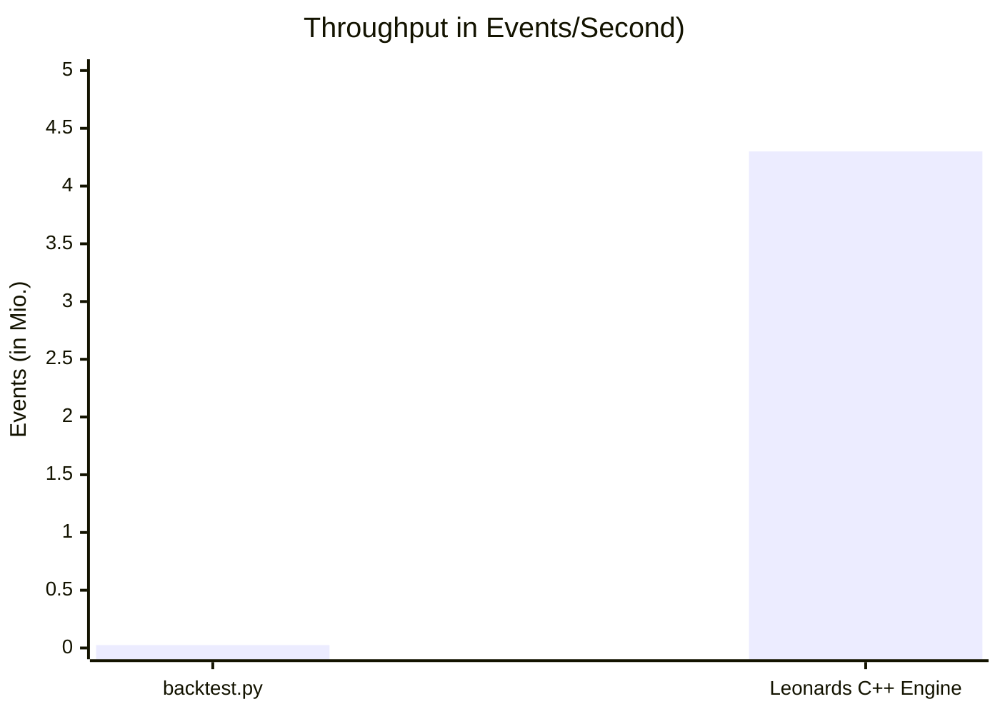

# HFT-Engine (Work in Progress)

An Engine to backtest High-Frequenzy-Trading strategies. Using C++23 and PostgreSQL


**I am working on a solution to import your own data via CSV.  Currently, only the following format works:**  
```
ID, symbol, date, time (without zone), open, high, low, close, volume
```

## Benchmark


## Functionality
```mermaid
flowchart TD
    Start([Start: Load Historical Data]) --> Init[Create MarketEvents from Data]
    Init --> Queue[Add to Event Queue]
    Queue --> Loop{Event Queue Empty?}
    
    Loop -->|No| GetEvent[Get Next Event]
    Loop -->|Yes| End([End: Load Next Dataset])
    
    GetEvent --> CheckType{Event Type?}
    
    CheckType -->|MarketEvent| Strategy[Strategy: on_market]
    Strategy --> StrategyDecision{Trading Decision?}
    StrategyDecision -->|Yes| CreateOrder[Create OrderEvent]
    StrategyDecision -->|No| Loop
    CreateOrder --> AddOrderToQueue[Add OrderEvent to Queue]
    AddOrderToQueue --> Loop
    
    CheckType -->|OrderEvent| Orderbook[Orderbook: add_order]
    Orderbook --> Match[Match Orders]
    Match --> MatchSuccess{Match Successful?}
    MatchSuccess -->|Yes| CreateFill[Create FillEvent]
    MatchSuccess -->|No| Loop
    CreateFill --> AddFillToQueue[Add FillEvent to Queue]
    AddFillToQueue --> Loop
    
    CheckType -->|FillEvent| Portfolio[Portfolio: on_fill]
    Portfolio --> UpdatePortfolio[Update Positions & Cash]
    UpdatePortfolio --> NotifyStrategy[Notify Strategy: set_position_open]
    NotifyStrategy --> Loop
    
    CheckType -->|SignalEvent| SignalHandler[Signal Handler]
    SignalHandler --> Loop

    style Start fill:#4CAF50
    style End fill:#4CAF50
    style Strategy fill:#2196F3
    style Orderbook fill:#FF9800
    style Portfolio fill:#9C27B0
    style Loop fill:#FFC107
  ```

## Build Instructions

This project now automatically downloads and builds `libpqxx` from source. The only manual dependency you need to install is PostgreSQL.

### 1. Install PostgreSQL

You must have PostgreSQL installed and available in your system's PATH. You can download it from the official website: [https://www.postgresql.org/download/](https://www.postgresql.org/download/)

Make sure to install the development headers for PostgreSQL. If you use the graphical installer, they are usually included.

Additionally, you need to install the PostgreSQL client library (`libpq`) for your operating system:

*   **Ubuntu/Debian:** `sudo apt-get install libpq-dev`
*   **macOS:** `brew install postgresql` (installs both server and client libraries)
*   **Windows (using vcpkg):** `vcpkg install libpq` (you might need to install `vcpkg` first if you don't have it)

### 2. Configure the project with CMake

Once PostgreSQL is installed, you can configure the project.

```bash
# It is recommended to start with a clean build directory
cd hft-engine
(sudo) rm -rf build
mkdir build
cd build

# Configure the project
cmake ..
```

When you run `cmake`, it will first try to find your PostgreSQL installation. Then, it will download and compile `libpqxx`. This might take a few minutes the first time.

### 3. Build the project

Once CMake has been configured successfully, you can build the project with:

```bash
cmake --build .
```

This will create the `hft-engine` executable in the `build` directory.
```bash
./hft-engine
```

#### To DO / Planned:
- Level 3 Order Book Reconstruction
- Probabilistic Fill Model
- Stochastic Latency Modeling
- Maker/Taker Fee Schedules
- Pre-Trade Risk Engine


### Additionally
- Simultanously I am building an UI: https://github.com/LeonardFoerster/TradeUI
