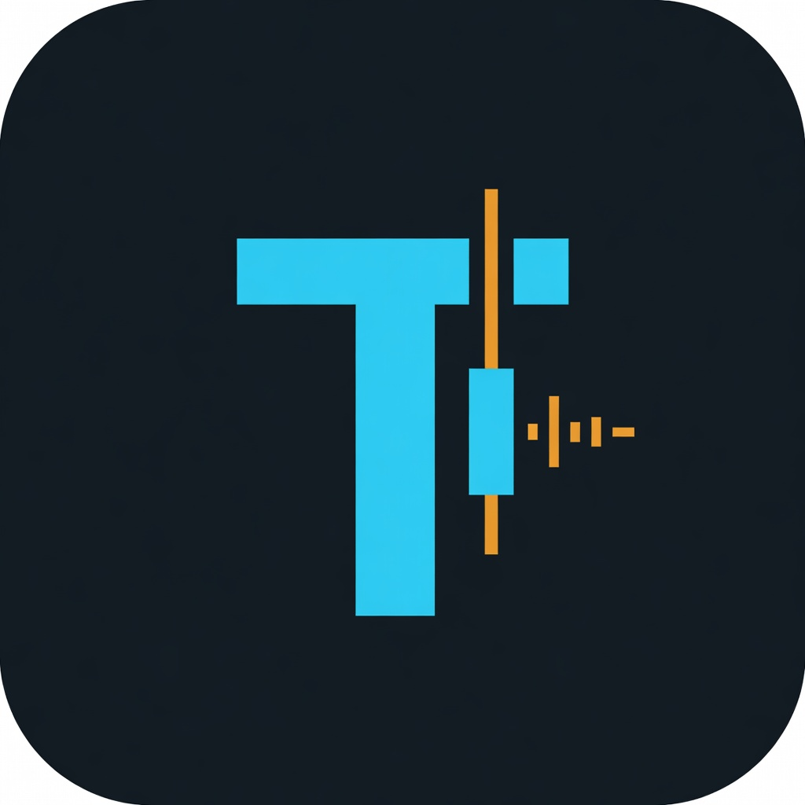
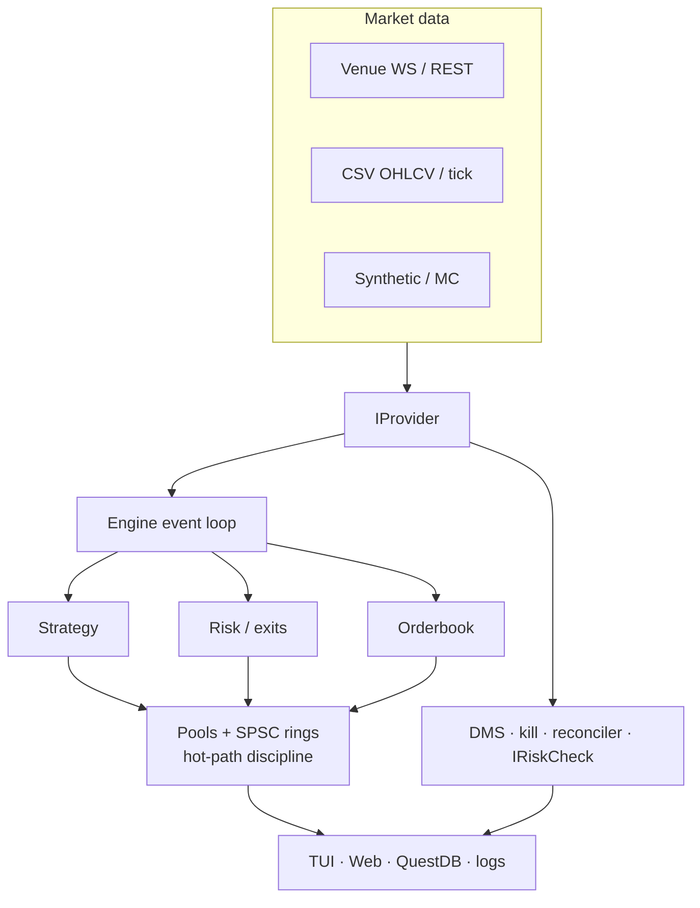

<p align="center">
  
</p>

<h1 align="center">TrueTest</h1>

<p align="center">
  <strong>Modular C++23 trading engine</strong> — reproducible backtests, shadow divergence,<br/>
  and gated live execution. One tree, three binaries, compile-time live gate.
</p>

<p align="center">
  
  
  
</p>

---

**Personal research / retail tool only** — not enterprise software, not financial advice.  
**Supported OS:** **Arch Linux** and **Fedora** only. Windows, macOS, and other distros are unsupported.  
**This repo** is the C++ engine (`truetest-core`). Sibling packages (`backend/`, `UI/`, …) are separate checkouts if you use the wider workspace.

Live orders are **compile-time impossible** in non-live binaries (`TT_TARGET` + DCE in `src/core/tt_target.h`).  
**Config precedence:** CLI flags override `--config` JSON; JSON overrides hard defaults. There is no `TRUETEST_CONFIG` env var.

| Binary | `TT_TARGET` | Live orders | Use |
|:-------|:------------|:------------|:----|
| `engine_backtest` | `BACKTEST` | Impossible | Historical replay, Monte Carlo |
| `engine_shadow` | `SHADOW` | Impossible | Real-time paper vs exchange |
| `engine_live` | `LIVE` | Allowed (gated) | Real money — experimental, attended |

---

## 60-second happy path

Arch (minimal packages for a synthetic backtest):

```bash
sudo pacman -S --needed base-devel cmake git ninja gcc
git clone https://github.com/LeonardFoerster/truetest-core.git
cd truetest-core
cmake --preset linux-tests
cmake --build --preset linux-tests -j"$(nproc)"
./out/build/linux-tests/engine_backtest \
  --provider synthetic --strategy sma --seed 424242 \
  --no-pin --status-format off --no-tui \
  --output /tmp/run.json
```

Fedora: install `cmake git ninja-build gcc gcc-c++` via `dnf`, then the same `cmake` / run lines.  
First configure needs **network** (FetchContent pulls CLI11, zstd, nlohmann/json at pinned tags).

Full tests after build: `ctest --test-dir out/build/linux-tests --output-on-failure`.

---

## Install packages

### Arch Linux / Manjaro / EndeavourOS

```bash
# Toolchain + recommended
sudo pacman -S --needed base-devel cmake git ninja pkgconf gcc clang

# Shadow / live TUI
sudo pacman -S --needed ncurses

# Venue providers (Binance / Bitget / Bitunix / LIVE_DATA)
sudo pacman -S --needed boost openssl

# Optional: web SPA assets
sudo pacman -S --needed nodejs npm
```

### Fedora

```bash
sudo dnf groupinstall -y "Development Tools" "C Development Tools and Libraries"
sudo dnf install -y \
  cmake git ninja-build pkgconf-pkg-config \
  gcc gcc-c++ \
  ncurses-devel \
  boost-devel openssl-devel \
  nodejs npm   # optional
```

GCC **≥ 13** or Clang **≥ 16**. If CMake cannot find Boost after enabling venues, install the distro `-devel` package and reconfigure in a clean build dir.

---

## Build

| Style | Configure | Binaries |
|:------|:----------|:---------|
| **Preset** (preferred) | `cmake --preset linux-tests` | `out/build/linux-tests/` |
| **Ad-hoc** | `cmake -B build -DBUILD_TESTS=ON` | `build/` |

```bash
cmake --preset linux-tests
cmake --build --preset linux-tests -j"$(nproc)"

# Common feature presets
cmake --preset linux-binance-questdb && cmake --build --preset linux-binance-questdb -j"$(nproc)"
cmake --preset linux-bitget   && cmake --build --preset linux-bitget -j"$(nproc)"
cmake --preset linux-bitunix  && cmake --build --preset linux-bitunix -j"$(nproc)"
cmake --preset linux-venues   && cmake --build --preset linux-venues -j"$(nproc)"
cmake --preset linux-web      && cmake --build --preset linux-web -j"$(nproc)"
cmake --preset linux-asan     && cmake --build --preset linux-asan -j"$(nproc)"
cmake --preset linux-release-native && cmake --build --preset linux-release-native -j"$(nproc)"
```

| CMake option | System deps |
|:-------------|:------------|
| Minimal backtest | compiler, cmake, git (+ ninja) |
| Shadow / live link | **ncurses** |
| `ENABLE_BINANCE` / `BITGET` / `BITUNIX` / `LIVE_DATA` | **Boost** + **OpenSSL** |
| `ENABLE_QUESTDB` | none extra |
| `ENABLE_WEB` | civetweb via FetchContent; **npm** for SPA |
| `BUILD_TESTS` / `ENABLE_BENCHMARKS` / `ENABLE_DEBUG` | GTest / Benchmark / Abseil via FetchContent |

Source lists: `cmake/Sources.cmake` (no globs).

---

## Architecture

Simplified data path (not every engine stage):



**Provider is the only venue extension point** (`IProvider` + safety hooks). Core must not grow `HAS_*` venue ifdefs.  
Hot path aims for **zero heap / low jitter** (pools, prewarm, `forbid_runtime_grow`); not every cold path is allocation-free.  
Details: [`docs/architecture/`](docs/architecture/) · [`AGENTS.md`](AGENTS.md).

---

## What you can run today

- **Backtest / MC** — CSV, synthetic, realism models, multi-trial MC (`--mc-reuse-objects`; `--mc-parallel` with `--thread-preset inline`)
- **Shadow** — paper vs venue (Binance golden path; Bitget landed; Bitunix MD/shadow Phase 0–1)
- **Live** — `engine_live` only, experimental, tiny size, attended
- **Platform exits** — `--exit-policy` / `--sl` / `--tp`
- **Obs** — ncurses TUI (shadow/live), optional web (`ENABLE_WEB`), optional QuestDB (`ENABLE_QUESTDB`)
- **Strategies** — e.g. `sma`, `ma-crossover`, `mean-reversion`, `breakout` / `coiled-spring`, `adaptive-hybrid`, `structure-continuation` (see strategy docs)

Full feature and flag reference: [`docs/reference/`](docs/reference/).  
Planned work (not shipped): [`docs/todos/`](docs/todos/) · Phase 0 **0/15** sessions in [`reports/phase0/`](reports/phase0/).

| Venue | CLI | Notes |
|:------|:----|:------|
| Binance | `binance`, `binance-futures` | Golden path |
| Bitget | `bitget`, `bitget-futures` | UTA USDT-M; demo via `--demo` |
| Bitunix | `bitunix`, `bitunix-futures` | Live routing refused |
| Local / synthetic | `local`, `synthetic` | Always available |

---

## Workflows

Paths assume a **preset** build under `out/build/…` (use `./build/…` for ad-hoc).

### Credentials

Env vars **win over** CLI secrets (CLI can leak via process lists). Never commit keys.

```bash
export TRUETEST_BINANCE_API_KEY="…"
export TRUETEST_BINANCE_API_SECRET="…"
# Bitget also: TRUETEST_BITGET_API_PASSPHRASE
# Bitunix: TRUETEST_BITUNIX_API_KEY / _SECRET
```

Optional: `scripts/check-credentials.sh`. Flags: [`docs/reference/04-flags.md`](docs/reference/04-flags.md).

### 1. CSV backtest

```bash
./build/engine_backtest \
  --provider local \
  --path market_data.csv \
  --strategy sma
```

### 2. Headless synthetic / CI

```bash
./out/build/linux-tests/engine_backtest \
  --provider synthetic --strategy sma --seed 424242 \
  --no-pin --status-format off --no-tui \
  --output /tmp/run.json
```

### 3. Monte Carlo

```bash
./out/build/linux-tests/engine_backtest \
  --provider synthetic --strategy sma \
  --monte-carlo --mc-trials 50 \
  --mc-reuse-objects --thread-preset inline \
  --no-pin --status-format off --no-tui
```

### 4. Shadow vs Binance futures (needs `ENABLE_BINANCE`)

```bash
./out/build/linux-binance-questdb/engine_shadow \
  --provider binance-futures \
  --symbol BTCUSDT \
  --stream trade \
  --depth-stream depth20@100ms \
  --persist --run-tag my_shadow_run
```

### 5. Bitget paper (needs `ENABLE_BITGET`; not Phase 0 qualifying)

```bash
./out/build/linux-bitget/engine_shadow \
  --provider bitget-futures \
  --symbol BTCUSDT \
  --stream trade \
  --depth-stream books5 \
  --no-pin --status-format off --no-tui
```

### 6. Live (experimental)

> **Do not run `engine_live` on mainnet until Phase 0 discipline is in place.**  
> Needs `--live`, credentials, captcha ritual, tiny size, full attendance.  
> See [`docs/governance/01-prod.md`](docs/governance/01-prod.md).

### 7. Web UI (read-only; needs `ENABLE_WEB`)

```bash
cmake -B build -DENABLE_WEB=ON && cmake --build build -j
cd src/web/frontend && npm ci && npm run build
./build/engine_shadow ... --web --web-token <secret> --web-assets src/web/assets
# http://127.0.0.1:8080/  — shadow/live require --web-token
```

---

## Dependencies (system vs FetchContent)

| Component | When | Notes |
|:----------|:-----|:------|
| CMake ≥ 3.22, C++23, Git | Always | |
| Ninja, pkg-config | Recommended | Presets use Ninja |
| ncurses (Curses) | Shadow / live | `find_package(Curses REQUIRED)` |
| Boost, OpenSSL | Venues / `LIVE_DATA` | `find_package` in `cmake/Dependencies.cmake` |
| Node.js + npm | Optional web SPA | `web_assets` only |

| Fetched automatically | Trigger |
|:----------------------|:--------|
| CLI11, zstd, nlohmann/json | Always |
| GoogleTest | `BUILD_TESTS` |
| Google Benchmark | `ENABLE_BENCHMARKS` |
| civetweb | `ENABLE_WEB` |
| Abseil | `ENABLE_DEBUG` |

---

## Gates, freeze & testing

```bash
cmake --preset linux-tests && cmake --build --preset linux-tests -j
ctest --test-dir out/build/linux-tests --output-on-failure

# After any edit under src/
./scripts/check-hotpath-json.sh
./scripts/check-layer-deps.sh
./scripts/check-live-safety-freeze.sh
```

**Phase 1 freeze** (token `LIVE_SAFETY_CCB_APPROVED` + CCB + clean shadow):  
`tt_target.h`, `engine.cpp`, Binance futures safety headers, `risk_manager.h`, `futures_risk_check.h`, `live_safety.h`, `worker_watchdog.h` — exact list in `scripts/check-live-safety-freeze.sh`.  
→ [`docs/governance/01-prod.md`](docs/governance/01-prod.md) · [`02-prerequisites.md`](docs/governance/02-prerequisites.md) · [`AGENTS.md`](AGENTS.md)

| Phase | Status |
|:------|:-------|
| Phase 0 tiny-size mainnet | **0/15** qualifying |
| Phase 1 freeze | **Enforced** |

---

## Troubleshooting

| Symptom | Fix |
|:--------|:----|
| C++23 rejected | GCC ≥ 13 or Clang ≥ 16 on Arch/Fedora |
| Shadow/live Curses link error | Install `ncurses` / `ncurses-devel` |
| Boost/OpenSSL configure fail | Install devel packages or drop venue `ENABLE_*` |
| Binary not found after preset | Look under `out/build/<preset>/`, not `build/` |
| `--web` exits on shadow/live | Pass `--web-token` |
| Provider missing at runtime | Rebuild with matching `ENABLE_*` |
| MC parallel / affinity issues | `--thread-preset inline` with `--mc-parallel`; `--no-pin` in containers |
| Windows / macOS / other Linux | **Unsupported** — use Arch or Fedora |

---

## Documentation

| Doc | Purpose |
|:----|:--------|
| [`docs/reference/01-instructions.md`](docs/reference/01-instructions.md) | Master how-to |
| [`docs/reference/04-flags.md`](docs/reference/04-flags.md) | CLI flags |
| [`docs/reference/07-strategy-development.md`](docs/reference/07-strategy-development.md) | Strategies |
| [`docs/governance/01-prod.md`](docs/governance/01-prod.md) | Phases / live ritual |
| [`docs/todos/`](docs/todos/) | Backlog |
| [`docs/platforms/`](docs/platforms/) | Venues |
| [`AGENTS.md`](AGENTS.md) | Agent rules, freeze, hot path |
| [`docs/README.md`](docs/README.md) | Full nav |

---

## License & disclaimer

- No `LICENSE` file in-tree — treat as **private personal research** unless the author publishes one.
- **Not financial advice.** Live trading can lose all capital. Tiny size, attend the process, respect Phase 0/1.
- Not multi-tenant production software.

---

<p align="center">
  <sub>Arch Linux · Fedora · personal research only · live trading is your risk</sub>
</p>
