# TrueTest HFT-Engine — vollständiges Architekturdiagramm

> Jede Mermaid-Graph unten ist ein eigener Teilausschnitt der Engine. Zusammen decken sie
> **jede Klasse, jeden Worker, jede Ring-Buffer-Verbindung, jeden CLI-Switch, jeden
> Object-Pool, jeden Provider, jeden Fee-/Latency-/Fill-Model-Zweig, jede Risk-Regel
> und jede I/O-Senke** ab, die der Code hergibt.
>
> Zum Betrachten entweder direkt auf GitHub öffnen (Mermaid wird nativ gerendert),
> in VS Code mit Mermaid-Preview-Plugin, oder in einem Browser mit
> `https://mermaid.live/` und dem Inhalt eines Blocks einfügen.

## Inhalt

1. [Top-Level-Datenfluss](#1-top-level-datenfluss)
2. [Build-System & TT_TARGET-Gating](#2-build-system--tt_target-gating)
3. [CLI, Config, Einstiegspunkt `main.inc`](#3-cli-config-einstiegspunkt-maininc)
4. [Engine-Klasse — Membervariablen & Lebenszyklus](#4-engine-klasse--membervariablen--lebenszyklus)
5. [Event-Pipeline & Object-Pools](#5-event-pipeline--object-pools)
6. [Event-Typen (alle Felder)](#6-event-typen-alle-felder)
7. [`run()` — Batch-Mode (Bars + Ticks)](#7-run--batch-mode-bars--ticks)
8. [`run_streaming()` — Live-Mode](#8-run_streaming--live-mode)
9. [`run_replay()` — Event-Log-Wiedergabe](#9-run_replay--event-log-wiedergabe)
10. [Provider-System (Registry, Transport, Parser, Bridge)](#10-provider-system-registry-transport-parser-bridge)
11. [Binance-Provider (Detail, Paper/Hybrid/Live)](#11-binance-provider-detail-paperhybridlive)
12. [Execution-Layer (Adapter, Portfolio, Fees, Latency, Fill-Model)](#12-execution-layer-adapter-portfolio-fees-latency-fill-model)
13. [Orderbuch & Matching](#13-orderbuch--matching)
14. [Strategien & Indikatoren](#14-strategien--indikatoren)
15. [Risk-Manager (alle Regeln)](#15-risk-manager-alle-regeln)
16. [Analytics & Report-Generator](#16-analytics--report-generator)
17. [Threading — Presets, Rings, Spin-Policy, Affinität](#17-threading--presets-rings-spin-policy-affinität)
18. [Worker-Klassen (Detail)](#18-worker-klassen-detail)
19. [Daten-Layer & Persistenz](#19-daten-layer--persistenz)
20. [WebSocket-UI & Kommandos](#20-websocket-ui--kommandos)
21. [Checkpoint-Format & Resume](#21-checkpoint-format--resume)
22. [Binary Event-Log-Format](#22-binary-event-log-format)
23. [C-API (`libtruetest.so`)](#23-c-api-libtruetestso)
24. [Debug-Instrumentierung](#24-debug-instrumentierung)
25. [Speicher-Allokatoren, Queues, Pools — Übersicht](#25-speicher-allokatoren-queues-pools--übersicht)

---

## 1. Top-Level-Datenfluss

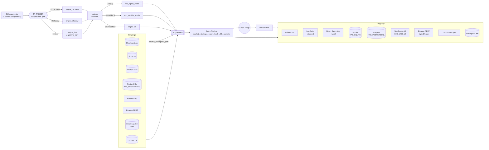

---

## 2. Build-System & TT_TARGET-Gating

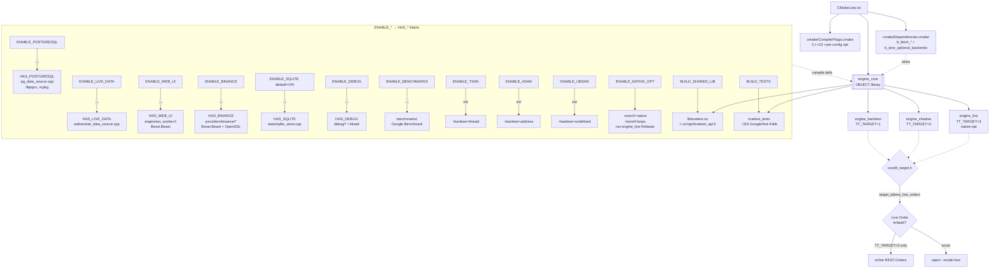

---

## 3. CLI, Config, Einstiegspunkt `main.inc`

```mermaid
flowchart TD
    START([argc,argv]) --> PARSE[register_cli_options<br/>~50 CLI11-Optionen]
    PARSE --> CFGFILE{--config-file?}
    CFGFILE -->|ja| OVERLAY[load_config_file<br/>JSON → cli_options]
    CFGFILE -->|nein| SIG
    OVERLAY --> SIG[Signal-Handler<br/>SIGINT/SIGTERM → bridge.stop]

    SIG --> DRY{--dry-run?}
    DRY -->|ja| DUMP[dump_config → exit 0/1]
    DRY -->|nein| MODE{Mode wählen}

    MODE -->|--replay PATH| RP[run_replay_mode]
    MODE -->|--provider X| PR[run_provider_mode]
    MODE -->|sonst| CSV_MODE[CSV / TUI]

    subgraph CLI[cli_options — alle Felder]
        direction LR
        C1[Data/Logging<br/>replay_path<br/>replay_from/to_us<br/>event_log_path<br/>log_file_path<br/>log_max_size_mb<br/>log_keep<br/>compress_log<br/>seed<br/>thread_preset_str<br/>spin_policy_str<br/>no_pin]
        C2[Provider<br/>provider_name<br/>provider_path<br/>symbol<br/>stream<br/>api_key/secret<br/>host/port<br/>record_path<br/>replay_data_path<br/>live / testnet]
        C3[Strategy<br/>strategy<br/>format<br/>sma_period<br/>params k=v]
        C4[Mode<br/>mode<br/>TT_DEFAULT_MODE]
        C5[Fees<br/>fee_model<br/>fee_value<br/>maker_rate<br/>taker_rate]
        C6[UI<br/>enable_web_ui<br/>ws_port<br/>ws_compress]
        C7[Portfolio<br/>balance<br/>risk_fraction<br/>sl_pct<br/>tp_pct]
        C8[DB<br/>db_path<br/>no_db]
        C9[Checkpoint<br/>checkpoint_path<br/>resume_path<br/>checkpoint_interval]
        C10[Backfill<br/>backfill<br/>backfill_interval]
        C11[Execution<br/>market_aggression<br/>qty_scale<br/>fill_rng_seed<br/>spread_step<br/>debug_fills<br/>debug_fills_budget]
        C12[Risk<br/>max_position_value<br/>max_drawdown<br/>max_loss_per_trade<br/>max_open_orders<br/>max_portfolio_exposure<br/>max_daily_loss<br/>daily_reset_hour<br/>max_trades_per_hour<br/>max_orders_per_minute<br/>risk_unwind]
        C13[Analysis<br/>rolling_window<br/>risk_free_rate<br/>output<br/>output_format]
        C14[Meta<br/>config_file<br/>dump_config_flag<br/>dry_run]
    end

    PARSE --> CLI

    RP --> E1[engine.run_replay<br/>path, from_us, to_us]
    PR --> PRV[ProviderRegistry.create]
    PRV --> E2[engine.run_streaming]
    CSV_MODE --> DL[data_handler.load_from_csv]
    DL --> E3{has_tick_data?}
    E3 -->|ja| E3T[engine.run_tick_data]
    E3 -->|nein| E3B[engine.run]

    E1 --> FIN[export_results CSV/JSON<br/>engine.print_summary]
    E2 --> FIN
    E3T --> FIN
    E3B --> FIN
    FIN --> EXIT([exit-code])
```

---

## 4. Engine-Klasse — Membervariablen & Lebenszyklus

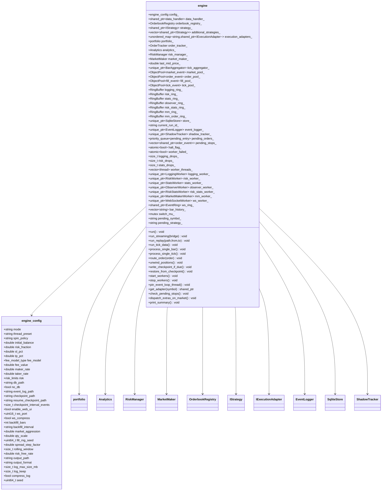

---

## 5. Event-Pipeline & Object-Pools

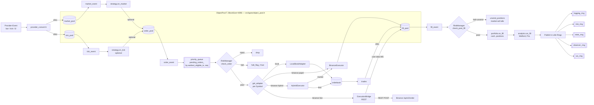

---

## 6. Event-Typen (alle Felder)

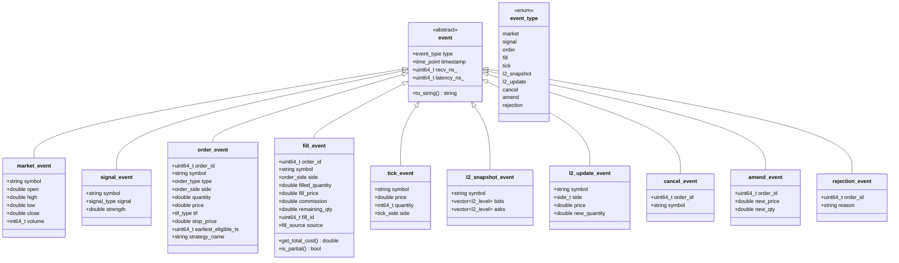

---

## 7. `run()` — Batch-Mode (Bars + Ticks)

```mermaid
flowchart TD
    S([engine.run]) --> SW[start_workers<br/>pro thread_preset]
    SW --> PIN[pin_event_loop_thread<br/>sched_setaffinity]
    PIN --> SQL[SqliteStore.record_run_begin<br/>HAS_SQLITE]
    SQL --> LOAD{has_bar_data<br/>or has_tick_data?}

    LOAD --> LOOP{while not halt_flag_<br/>and data verfügbar}
    LOOP -->|bar vorhanden| BAR[dequeue bar_record]
    BAR --> PSB[process_single_bar]
    PSB --> PSB1[update last_mid_price_]
    PSB1 --> PSB2[analytics_.on_market]
    PSB2 --> PSB3[strategy_.on_market]
    PSB3 --> PSB4{optional order?}
    PSB4 -->|ja| PSB5[queue in pending_orders_<br/>earliest_eligible_ts + seq]
    PSB4 -->|nein| PSB6
    PSB5 --> PSB6[dispatch_extras_on_market<br/>shadow + WS broadcast]
    PSB6 --> PSB7[BarAggregator update<br/>tick→bar]

    LOOP -->|tick vorhanden| TICK[process_single_tick]
    TICK --> TCK1[apply L2 updates]
    TCK1 --> TCK2[strategy_.on_tick]

    PSB7 --> PEND[Pending Orders prüfen]
    TCK2 --> PEND
    PEND --> PPOP{pop eligible<br/>by ts,seq}
    PPOP --> ROUTE[route_order]
    ROUTE --> RC1{check_order<br/>pre-fill}
    RC1 -->|reject/halt| SKIP
    RC1 -->|pass| ADP[adapter.submit_order]
    ADP --> PUBO[publish order_event in Rings]
    PUBO --> CPS[check_pending_stops<br/>high/low/ts]

    CPS --> POLL[poll_fills für jedes Adapter]
    SKIP --> POLL
    POLL --> FEACH{für jede fill_event}
    FEACH --> FRC[risk_manager_.check_post_fill]
    FRC -->|halt| SETHALT[halt_flag_=true]
    FRC -->|pass| PFILL[portfolio_.on_fill]
    PFILL --> AFILL[analytics_.on_fill]
    AFILL --> PUBF[publish fill_event in Rings]

    PUBF --> UNW{risk_unwind<br/>und halt?}
    SETHALT --> UNW
    UNW -->|ja| UNWD[unwind_positions]
    UNW -->|nein| CKP
    UNWD --> CKP[write_checkpoint_if_due<br/>alle checkpoint_interval_events]
    CKP --> WSCMD[WebSocket-Kommandos verarbeiten]
    WSCMD --> INC[event_count++]
    INC --> LOOP

    LOOP -->|fertig| STOP[stop_workers<br/>running_=false]
    STOP --> DRAIN[alle Rings drainen]
    DRAIN --> END[SqliteStore.record_run_end]
    END --> REP[analytics_.generate_report<br/>equity curve, Sharpe, DD]
    REP --> EXP[export CSV/JSON]
    EXP --> DONE([return])
```

---

## 8. `run_streaming()` — Live-Mode

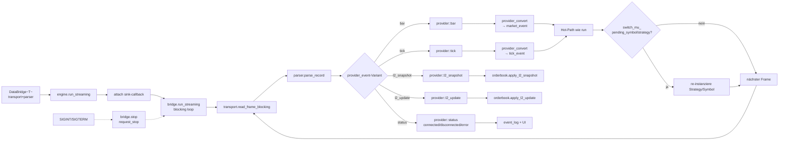

---

## 9. `run_replay()` — Event-Log-Wiedergabe

```mermaid
flowchart TD
    RS([engine.run_replay<br/>path, from_us, to_us]) --> OPEN[EventLogger.load]
    OPEN --> DECOMP{compress_log?}
    DECOMP -->|ja| ZSTD[zstd-Dekompression<br/>ZSTD_DCtx]
    DECOMP -->|nein| RAW
    ZSTD --> RAW[Raw-Bytes]
    RAW --> BR[BufReader<br/>read_u8/u16/u32/u64<br/>read_i64/f64/str/ts]

    BR --> ITR[iterate Events]
    ITR --> FILT{timestamp in<br/>from_us..to_us?}
    FILT -->|nein| SKIP1[skip]
    FILT -->|ja| DECODE{event_type}

    DECODE -->|market| RM[re-inject in strategy+analytics]
    DECODE -->|tick| RT[re-inject in strategy]
    DECODE -->|order| RO[re-inject in portfolio+adapter]
    DECODE -->|fill| RF[portfolio.on_fill + analytics.on_fill]
    DECODE -->|l2_snapshot| RLS[orderbook.apply_l2_snapshot]
    DECODE -->|l2_update| RLU[orderbook.apply_l2_update]
    DECODE -->|cancel| RC[adapter.cancel_order]
    DECODE -->|amend| RA[adapter.modify_order]
    DECODE -->|rejection| RJ[log only]

    RM --> NEXT[next event]
    RT --> NEXT
    RO --> NEXT
    RF --> NEXT
    RLS --> NEXT
    RLU --> NEXT
    RC --> NEXT
    RA --> NEXT
    RJ --> NEXT
    SKIP1 --> NEXT
    NEXT --> ITR

    ITR -->|EOF| FIN[analytics.generate_report]
    FIN --> EXIT([Ende])
```

---

## 10. Provider-System (Registry, Transport, Parser, Bridge)

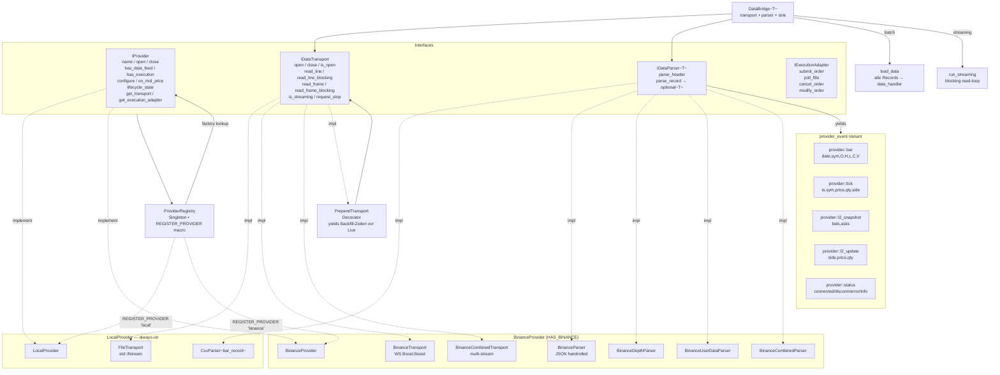

---

## 11. Binance-Provider (Detail, Paper/Hybrid/Live)

```mermaid
flowchart TD
    OP[BinanceProvider.open] --> EP[binance::endpoints<br/>from_host → mainnet/testnet]
    EP --> WS[BinanceTransport<br/>stream_type:<br/>trade / kline_1m / depth]

    WS --> BF{backfill_bars > 0<br/>und kline-Stream?}
    BF -->|ja| BFT[BinanceBackfill<br/>GET /api/v3/klines<br/>limit=1000, paginate]
    BFT --> ENC[encode als synthetisches kline-JSON]
    ENC --> PT[PrependTransport<br/>inject vor Live-Stream]
    PT --> OUT1[transport_ final]
    BF -->|nein| OUT1

    OP --> MODECHK{mode?}
    MODECHK -->|live + api_key| LIVE[LIVE-PFAD]
    MODECHK -->|paper/shadow/backtest| PAPER[PAPER-PFAD]

    subgraph LIVE[LIVE - echte REST-Orders]
        CLK[binance::verify_clock_skew<br/>±1000ms, server_time_ms]
        REST[BinanceRestClient<br/>GET/POST/DEL<br/>HMAC-SHA256 signed<br/>weight_cap 1200/min]
        AUTH[binance_auth.h<br/>sign_query]
        ORDTX[BinanceRestOrderTransport<br/>POST /api/v3/order]
        OENC[BinanceOrderEncoder<br/>BTCUSDT encoding]
        UDT[BinanceUserDataTransport<br/>listenKey<br/>WS /ws/<listenKey><br/>PUT alle 30min]
        UDP[BinanceUserDataParser<br/>executionReport]
        EB[ExecutionBridge<br/>order_tx + fill_tx + encoder + parser]

        CLK --> REST
        AUTH --> REST
        REST --> ORDTX
        REST --> UDT
        OENC --> EB
        UDP --> EB
        ORDTX --> EB
        UDT --> EB
    end

    subgraph PAPER[PAPER/HYBRID]
        LB[LocalBookAdapter<br/>orderbook-Matching]
        PX[BinanceExecutor<br/>PAPER-Fills am last_price]
        HX[HybridExecutor<br/>market→paper<br/>limit→book<br/>on_mid_price seedet 10 Levels je Seite]
        HX --> PX
        HX --> LB
    end

    LIVE --> EXEC[executor_ = ExecutionBridge]
    PAPER --> EXEC2[executor_ = HybridExecutor]

    subgraph REC[Record/Replay]
        REC1[BinanceRecorder<br/>Live-WS → Datei]
        REC2[BinanceReplayTransport<br/>Datei → Transport-Interface]
    end

    WS -.-> REC1
    REC2 -.-> BPV[BinanceProvider]

    subgraph STREAMS[Unterstützte Streams]
        S1[<sym>@trade]
        S2[<sym>@kline_1m..1M]
        S3[<sym>@depth]
        S4[combined /stream?streams=...]
    end
```

---

## 12. Execution-Layer (Adapter, Portfolio, Fees, Latency, Fill-Model)

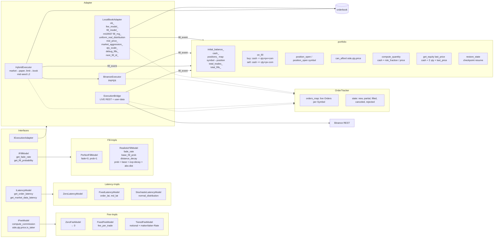

---

## 13. Orderbuch & Matching

```mermaid
flowchart TD
    subgraph OBReg[OrderbookRegistry]
        REG[unordered_map<br/>symbol → shared_ptr-orderbook]
        REG_GOC[get_or_create symbol]
    end

    subgraph OB[orderbook — price-time priority]
        BL[bid_levels_<br/>sortierte Vektoren]
        AL[ask_levels_<br/>sortierte Vektoren]
        OM[order_map_<br/>order_id → order_node*<br/>O(1) lookup]
        NP[node_pool<br/>vector<unique_ptr-node_block><br/>4096 nodes/block]

        PL[price_level<br/>{Price, total_qty,<br/>order_node* head/tail}<br/>doubly-linked list]
        ON[order_node<br/>{shared_ptr-order, next, prev}]

        BL --> PL
        AL --> PL
        PL --> ON
        NP --> ON
        OM --> ON
    end

    subgraph METHODS[Methoden]
        M1[add_order → trades<br/>matched immediately]
        M2[cancel_order id]
        M3[match_order amend → trades]
        M4[modify_order id,px,qty]
        M5[apply_l2_snapshot bids,asks<br/>ganzes Buch ersetzen]
        M6[apply_l2_update side,px,qty<br/>qty=0 → level löschen]
        M7[get_order_infos → Snapshot]
    end

    subgraph ORD[order]
        O1[order_id]
        O2[side: buy/sell]
        O3[Price fixed-point]
        O4[quantity initial/remaining/filled]
        O5[order_type: GTC/FOK/IOC]
        O6[fill qty]
        O7[is_filled]
    end

    subgraph TR[Trade-Struktur]
        TR1[bid_trade: order_id, Price, quantity]
        TR2[ask_trade: order_id, Price, quantity]
    end

    REG --> OB
    M1 --> TR
    M3 --> TR
    OB --> METHODS
    OB --> ORD

    subgraph FILLMDL[fill_model.h — Wahrscheinlichkeits-Gating]
        FM1[get_fill_probability<br/>side,distance_from_mid]
        FM2[decide(rng): fill/no-fill]
    end
    METHODS -.wird aus LocalBookAdapter gerufen.-> FILLMDL
```

---

## 14. Strategien & Indikatoren

```mermaid
flowchart LR
    subgraph IS[IStrategy — Interface]
        S1[on_market event → optional-order_event]
        S2[on_tick event → optional-order_event]
        S3[on_l2_update → optional-order_event]
        S4[set_position_open symbol,open]
        S5[set_stops symbol,sl,tp,qty]
        S6[check_stops symbol,price,ts → optional-order]
        S7[get_param_schema → vector-param_def]
        S8[set_param key,value]
        S9[get_indicator_values symbol → pairs]
    end

    subgraph REG[StrategyRegistry — Singleton]
        R1[register_strategy name,factory]
        R2[create name → shared_ptr-IStrategy]
        R3[available]
        R4[has name]
        R5[REGISTER_STRATEGY macro<br/>statische Init-Zeit]
    end

    REG --> IS

    subgraph IMPL[Konkrete Strategien]
        I1[sma_strategy<br/>period=20<br/>buy: close > SMA<br/>sell: close < SMA]
        I2[mean_reversion_strategy<br/>RSI oversold/overbought<br/>+ SMA-Trendbestätigung<br/>dynamisches Sizing]
        I3[ma_crossover_strategy<br/>SMA fast / slow<br/>buy: fast > slow<br/>sell: Crossunder]
    end

    IS -.implement.-> IMPL

    subgraph IND[Indikatoren — src/indicator/]
        N1[simple_moving_average<br/>queue<double> window<br/>double sum<br/>update→optional<double>]
        N2[exponential_moving_average<br/>alpha]
        N3[rsi<br/>14-period default<br/>avg_gain / avg_loss]
        N4[bollinger<br/>SMA + stddev bands<br/>upper/lower]
    end

    IMPL --> IND
    I1 --> N1
    I2 --> N1
    I2 --> N3
    I3 --> N1

    REG -->|"main.inc: --strategy a,b,c"| MULTI[Multi-Strategy-Mode<br/>primary + additional_strategies_]
```

---

## 15. Risk-Manager (alle Regeln)

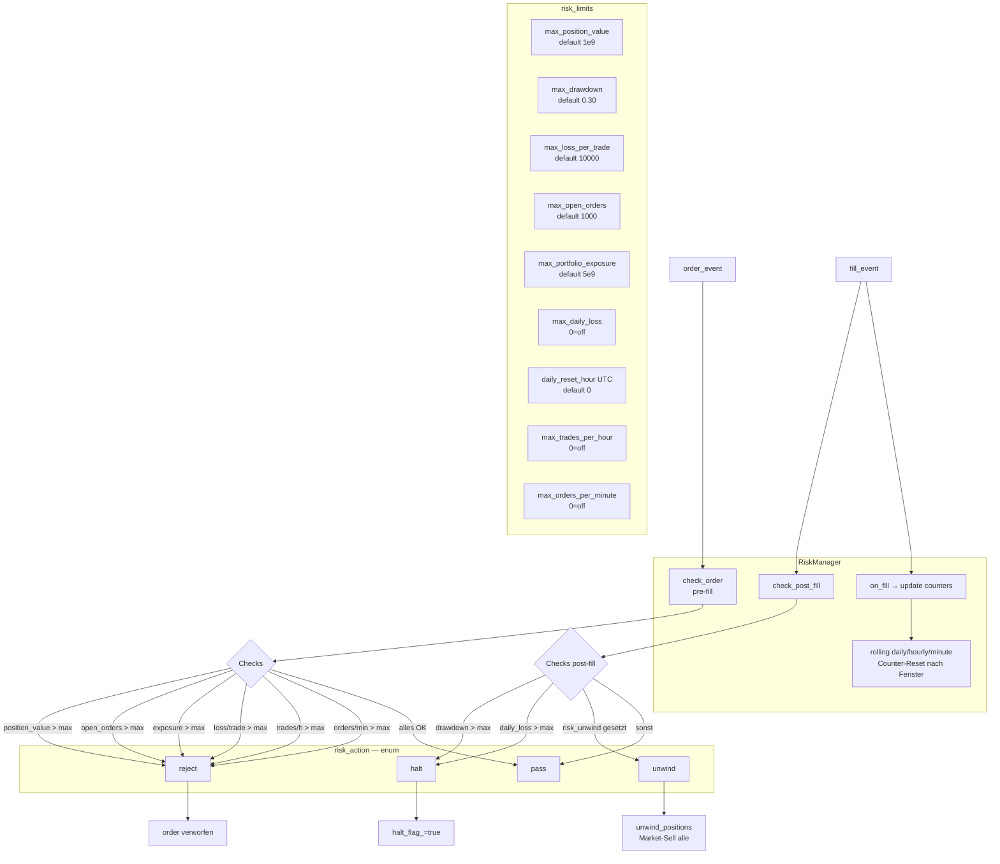

---

## 16. Analytics & Report-Generator

```mermaid
flowchart LR
    subgraph IN[Inputs]
        ME[market_event]
        OE[order_event]
        FE[fill_event]
    end

    IN --> ANA[Analytics : Worker]

    subgraph ANA[Analytics]
        A1[initial_equity]
        A2[vector-equity_point]
        A3[vector-trade_record]
        A4[vector-double returns]
        A5[Welford<br/>mean, variance, stddev]
        A6[on_event dispatcher]
        A7[snapshot → AnalyticsReport]
        A8[generate_report]
        A9[print_report]
        A10[export_csv / export_json]
    end

    subgraph REP[AnalyticsReport]
        R1[initial/final_equity<br/>cumulative_return]
        R2[equity_curve ts,eq]
        R3[sharpe_ratio<br/>sortino_ratio<br/>max_drawdown<br/>calmar_ratio]
        R4[total_trades/orders/fills<br/>win_rate<br/>avg_win/loss<br/>profit_factor]
        R5[slippage<br/>avg/fav/adv<br/>counts]
        R6[latency<br/>tick-to-trade<br/>min/max/avg_ns]
        R7[time_in_market<br/>avg_holding]
        R8[per-symbol<br/>win_rate, total_pnl, PF]
        R9[per-strategy<br/>Aufschlüsselung]
        R10[benchmark<br/>buy-and-hold<br/>alpha, beta<br/>information_ratio<br/>tracking_error]
        R11[trades-vector<br/>order_id, side, qty, fill_price,<br/>commission, intended_price,<br/>ts, pnl, symbol, strategy]
    end

    ANA --> REP

    subgraph HELP[Hilfsklassen]
        BA[BarAggregator<br/>tick→bar mit Intervall]
        ST[ShadowTracker<br/>reale vs. simulierte Fills<br/>PnL-Drift-Forensik]
    end

    BA --> ANA
    ST --> ANA
```

---

## 17. Threading — Presets, Rings, Spin-Policy, Affinität

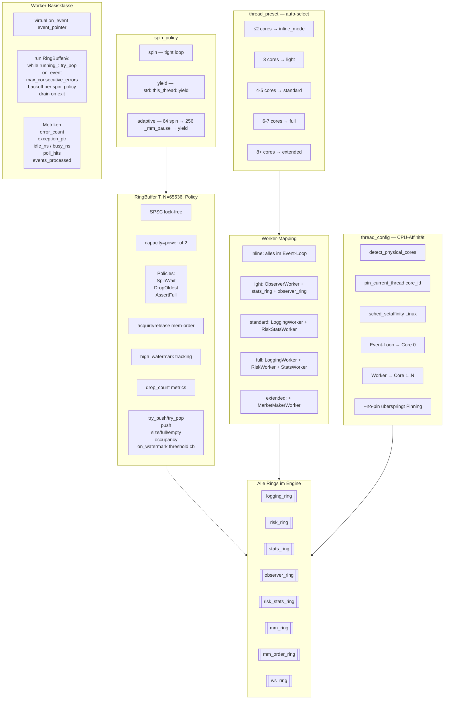

---

## 18. Worker-Klassen (Detail)

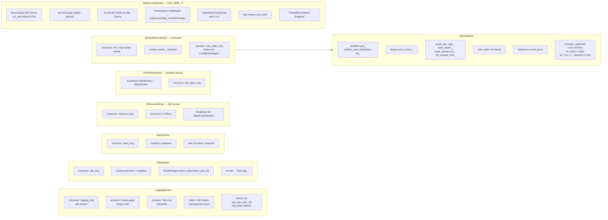

---

## 19. Daten-Layer & Persistenz

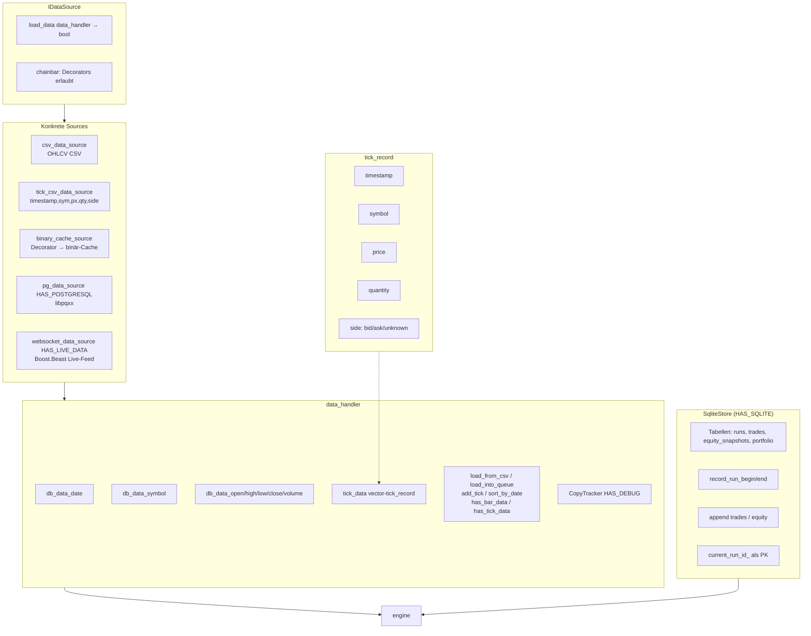

---

## 20. WebSocket-UI & Kommandos

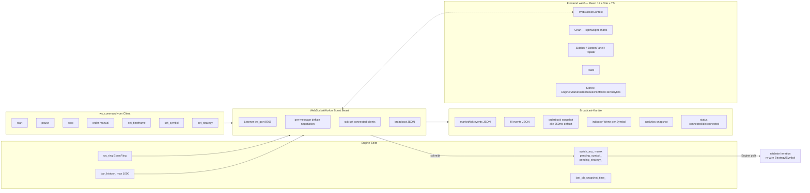

---

## 21. Checkpoint-Format & Resume

```mermaid
flowchart TD
    WRT[write_checkpoint_if_due<br/>alle N Events] --> HDR[Header schreiben]
    HDR --> H1[Magic 0x43484b50]
    HDR --> H2[Version 1]
    HDR --> H3[event_count u64]
    HDR --> H4[wall_ms u64]
    HDR --> H5[cash f64]
    HDR --> H6[initial_balance f64]
    HDR --> H7[total_trades u64]

    H7 --> POS[Position-Count N u32]
    POS --> LOOP{für jede Position}
    LOOP --> P1[u16 slen]
    LOOP --> P2[symbol bytes]
    LOOP --> P3[qty f64]
    LOOP --> P4[cost_basis f64]

    LOOP --> FILE[(checkpoint.bin)]

    subgraph RES[Resume bei ctor]
        R1[resume_checkpoint_path gesetzt]
        R2[restore_from_checkpoint]
        R3[Magic+Version prüfen]
        R4[portfolio.restore_state<br/>cash, total_trades, positions]
        R5[event_count wiederherstellen]
    end

    FILE -.-> RES
```

---

## 22. Binary Event-Log-Format

```mermaid
flowchart LR
    EL[EventLogger] --> OPEN[open path]
    OPEN --> Z{compress_log?}
    Z -->|ja| ZC[ZSTD_CCtx]
    Z -->|nein| NOC[raw]

    subgraph RECORD[Pro Event]
        REC1[type u8]
        REC2[timestamp ts]
        REC3[per-type felder<br/>u8/u16/u32/u64/i64/f64/str]
    end

    EL --> RECORD
    RECORD --> ZC
    ZC --> FILE[(event_log.bin)]
    NOC --> FILE

    subgraph READER[BufReader — Replay]
        R1[read_u8/u16/u32/u64]
        R2[read_i64]
        R3[read_f64]
        R4[read_str u16-length-prefix]
        R5[read_ts]
    end

    FILE --> ZD{komprimiert?}
    ZD -->|ja| ZDCTX[ZSTD_DCtx]
    ZD -->|nein| RAW
    ZDCTX --> READER
    RAW --> READER

    READER --> DESER[deserialize events]
    DESER --> RUNRPL[engine.run_replay Pipeline]
```

---

## 23. C-API (`libtruetest.so`)

```mermaid
flowchart TD
    subgraph API[src/api/truetest_api.h]
        F1[tt_version → const char*]
        F2[tt_create_engine config_json → handle]
        F3[tt_run handle → int]
        F4[tt_get_results handle → const char* JSON]
        F5[tt_free_string char*]
        F6[tt_destroy handle]
        F7[tt_last_error → const char*]
    end

    API --> CBIND[extern C<br/>visibility default<br/>__declspec dllexport]

    subgraph HOST[Host-Prozesse]
        H1[Python — ctypes/cffi]
        H2[Node.js — ffi-napi]
        H3[Rust — bindgen]
    end

    CBIND --> HOST

    API -->|intern| WRAP[Wrapper um engine<br/>JSON → engine_config<br/>engine.run<br/>results → JSON]
```

---

## 24. Debug-Instrumentierung

```mermaid
flowchart LR
    subgraph DBG[src/debug/ HAS_DEBUG]
        D1[StageTimer<br/>high_resolution_clock<br/>latencies per named stage]
        D2[MemorySampler<br/>malloc-Hooks<br/>Heap-Allocations]
        D3[hardware_info<br/>CPU, cores, L1/L2/L3]
        D4[thread_stats<br/>idle_ns, busy_ns,<br/>poll_attempts/hits,<br/>events_processed]
        D5[ring_stats<br/>push count, drop count,<br/>high_watermark]
        D6[CopyTracker~T~<br/>Template, zählt Kopien]
        D7[debug_log<br/>strukturierte Logs]
        D8[debug_report<br/>Aggregations-Report am Laufende]
    end

    ENG2[engine] -.HAS_DEBUG.-> DBG
    DBG --> REP[Debug-Report am Ende]
```

---

## 25. Speicher-Allokatoren, Queues, Pools — Übersicht

```mermaid
flowchart TB
    subgraph OP[ObjectPool T, BlockSize=4096]
        OP1[free_head: intrusive stack]
        OP2[pop → placement-new<br/>shared_ptr mit custom deleter]
        OP3[push via deleter → Destruktor + Rückgabe]
        OP4[Blöcke wachsen on-demand]
    end

    subgraph INST[Instanzen im Engine]
        I1[market_pool → market_event]
        I2[order_pool → order_event]
        I3[fill_pool → fill_event]
        I4[tick_pool → tick_event]
    end

    OP -.spezialisiert.-> INST

    subgraph RINGQ[Ring-Queues — SPSC]
        RQ1[logging_ring 65536]
        RQ2[risk_ring 65536]
        RQ3[stats_ring 65536]
        RQ4[observer_ring 65536]
        RQ5[risk_stats_ring 65536]
        RQ6[mm_ring 65536]
        RQ7[mm_order_ring 65536]
        RQ8[ws_ring 65536]
    end

    subgraph OTH[Sonstige Container]
        O1[pending_orders_<br/>priority_queue pending_entry<br/>min-heap nach ts,seq]
        O2[pending_stops_<br/>vector<shared_ptr<order_event>>]
        O3[day_order_ids_<br/>vector pair<string,u64>]
        O4[bar_history_<br/>vector<string>, max 1000]
        O5[price_history_<br/>deque double in MarketMaker]
        O6[orderbook node_pool<br/>unique_ptr-node_block<br/>4096 Nodes/Block]
        O7[order_map_<br/>unordered_map order_id→node*]
    end

    subgraph ALLOC[std heap]
        AH1[nlohmann::json nur Config/API<br/>nicht Hot-Path]
        AH2[BufReader/BufWriter-Puffer]
        AH3[ZSTD_CCtx/DCtx]
        AH4[Boost.Beast buffers]
    end

    INST --> RINGQ
    RINGQ --> OTH
    OTH --> ALLOC
```

---

## Legende / Konventionen

- `A -->|label| B` = Datenfluss mit Beschriftung
- `A -.-> B` = schwache / optionale Beziehung (z. B. compile-time gated)
- `[(X)]` = Datei / persistente Ressource
- `[[X]]` = Subsystem-Start
- `((X))` = Ring-Buffer / Queue
- `{X}` = Entscheidung / Zustand
- Alles in `HAS_*`-Klammern existiert nur bei gesetztem CMake-Flag.
