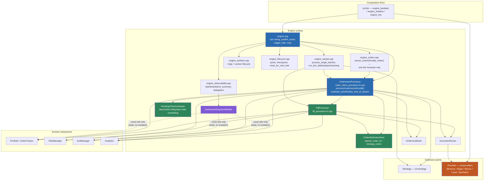
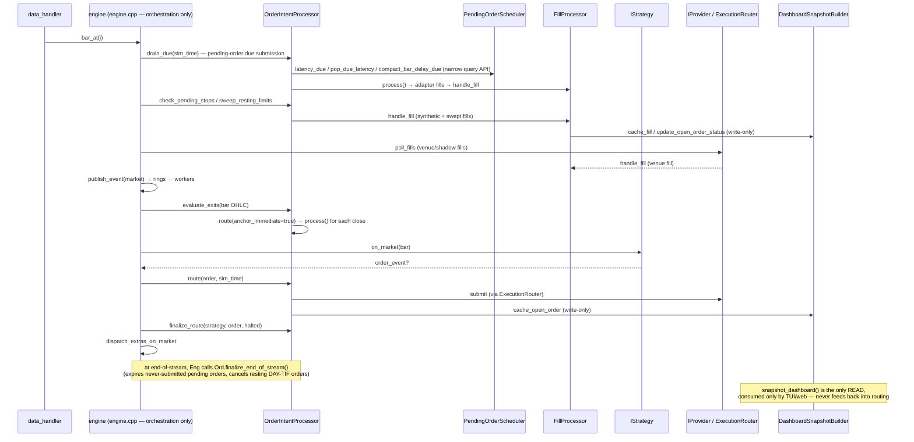

# Engine Boundaries (Phase 3: Architectural Hardening)

**Status**: Living document, updated 2026-08-19. Originally produced by the
engine-decomposition Phase 3 audit (**CLOSED — PASS WITH FOLLOW-UPS**, see
`docs/internal/engine-decomposition.md` → "Closure"); since then, the
`OrderIntentProcessor` extraction named in that closure as a follow-up has
been **completed** (its own session, see
`docs/internal/engine-decomposition.md` → "OrderIntentProcessor Extraction"
for the full report). This file has been updated in place to describe the
boundary as it actually exists today, not as it existed at the Phase 3
closure. Detailed audit evidence, call-site tables, and the full
responsibility matrix live in `docs/internal/engine-decomposition.md` — this
file is the thin, durable pointer other docs (`AGENTS.md`,
`01-target-architecture.md`) should link to.

**Target property**: *"engine.cpp is the map, not the city."* Engine
coordinates; it does not implement unrelated domain behavior.

---

## 0. Diagrams

**Component/dependency diagram** (post-Phase-3 state; arrow = "depends on"):

Note: `ORD --> STRAT` and `MKT --> STRAT` are call-parameter relationships
only (`IStrategy&` is passed in by the caller to `finalize_route`/`on_market`/
`on_tick`); neither `OrderIntentProcessor` nor `engine_market.cpp` stores a
strategy instance beyond the pre-existing `engine::strategy_`/
`additional_strategies_` members, which stay engine-owned.

**Event-flow diagram** (one bar-mode iteration of `engine::run()`):

---

## 1. Invariants

These extend the invariants already enforced in `02-model.md` (anti-patterns)
and `01-target-architecture.md` (safety surface). Where a mechanical check
exists it is named; where none exists, it is enforced by review.

| # | Invariant | Enforcement |
|---|---|---|
| 1 | `engine.cpp` owns top-level orchestration only (ctor/dtor, `log_event`, `publish_event`, `trigger_halt`, kill/shutdown, `run()`). Everything else lives in a sibling `engine_*.cpp` or an extracted collaborator. | Review + `ENGINE_LOC_MAX` guard (`cmake/Sources.cmake`) |
| 2 | Generic engine/pipeline code contains no exchange-specific branching. | `check-layer-deps.sh` Check A (vendor-header leak) |
| 3 | Provider-specific behavior stays behind the `IProvider` boundary. | `check-layer-deps.sh` Check A |
| 4 | Processors depend on domain subsystems (`Portfolio`, `RiskManager`, `ExecutionRouter`, ...), not on the concrete `engine` class, unless explicitly justified. | `check-layer-deps.sh` Check B |
| 5 | Observability (dashboard, logging, metrics, audit, QuestDB) consumes state; it is never a required participant in a trading decision. | Review (see §4) |
| 6 | Canonical mutable state has exactly one owner (see §3). | Review |
| 7 | No `EngineContext` / service locator. Every collaborator dependency is a distinct, named constructor parameter. | Review |
| 8 | `RiskManager` remains the owner of generic risk policy. | Review |
| 9 | `ExecutionRouter` / the execution subsystem remains the execution boundary. | Review |
| 10 | Safety mechanisms (Kill Switch, Dead Man's Switch, reconciler, watchdog, `halt_flag_`) retain distinct semantics — never collapsed into one generic safety manager. | `check-live-safety-freeze.sh` + `02-model.md` anti-patterns |
| 11 | `TT_TARGET` compile-time live-order gating is never replaced with a runtime-only check. | `src/core/tt_target.h` + review |
| 12 | Hot-path processors (event-loop call graph: `publish_event`, `OrderIntentProcessor::process`/`route`, `evaluate_exits`, the fill pipeline) may not allocate unless explicitly reviewed and measured. | `tests/test_hotpath_allocs.cpp`, `tests/test_hotpath_alloc_matrix.cpp` |

## 2. Dependency-direction rules

Module-level direction is enforced by `scripts/check-layer-deps.sh` (the
`ALLOWED[...]` graph). Phase 3 adds two finer-grained checks the module
graph cannot express on its own, because both violations are *within*
already-allowed module pairs:

- **Check A — vendor leak guard**: only `src/providers/` (adapter
  implementations) and `src/bin/` (composition root) may
  `#include "providers/{binance,bitget,bitunix}/..."`. Everything else —
  including `src/engine/` — may only see the generic `IProvider` /
  `IExecutionAdapter` / `IRiskCheck` interfaces. Audited clean as of
  2026-08-19 (no pre-existing violations).
- **Check B — engine-backreference guard**: a fixed, named list of
  extracted engine/ collaborator headers may not include `engine.h` or
  forward-declare `class engine`. The list (`scripts/check-layer-deps.sh`,
  `ENGINE_COLLABORATOR_HEADERS`) currently covers `dashboard_snapshot_builder.h`,
  `execution_router.h`, `checkpoint.h`, `instrument_spec_cache.h`,
  `order_audit_sink.h`, `fill_processor.h`, `live_safety_session.h`,
  `order_attribution_store.h`, `pending_order_scheduler.h`,
  `order_intent_processor.h`, `engine_hotpath_sink.h`, `risk_unwind_sink.h` —
  the last five added when the `OrderIntentProcessor` extraction landed
  (`docs/internal/engine-decomposition.md` → "OrderIntentProcessor
  Extraction"). Add a new collaborator header to this list the moment it is
  extracted (e.g. a future `MarketEventProcessor` — see §5 and §7). Audited
  clean as of 2026-08-19 (re-verified after the `OrderIntentProcessor`
  extraction: no `engine.h` include or `class engine` forward-declare in any
  of the twelve headers, and no back-reference from `OrderIntentProcessor`,
  `PendingOrderScheduler`, or `OrderAttributionStore` into `FillProcessor`'s
  own responsibilities or vice versa).

Both checks are additive deny-lists over a small, explicit set of files —
not a regex sweep of the whole tree — per the existing script's own
philosophy (see its header comment).

Still enforced only by review (no mechanical check exists, and none is
proposed here as the cost/benefit did not clear the bar — see §7):

- dashboard/web code becoming a dependency of the execution/risk path (the
  existing module graph already keeps `web` and `ui` from appearing in
  `ALLOWED[execution]`/`ALLOWED[risk]`, so this would already be caught by
  the module-level check, not a gap).
- lower-level domain components (`risk`, `execution`, `exits`, ...)
  including engine orchestration headers — likewise already excluded from
  those modules' allow-lists.

## 3. State ownership matrix (major components)

| Component | Owner | Constructed | Destroyed | Hot-path? | May allocate? | Threads touching it |
|---|---|---|---|---|---|---|
| `portfolio_`, `order_tracker_`, `analytics_`, `adverse_selection_`, `risk_manager_`, `exit_manager_` | `engine` (plain members) | engine ctor | engine dtor (member order) | Yes (mutated on event loop) | No (reserved/pooled) | Event-loop thread only (writers); snapshot reader is `DashboardSnapshotBuilder` under `dashboard_view_` mutex (read-only copy) |
| Order attribution (opener_order_id/strategy_name per order_id; former `order_meta_`) | `OrderAttributionStore` (`engine`-held `unique_ptr attribution_`; referenced by `OrderIntentProcessor` and `FillProcessor`, never duplicated) | ctor, before `fills_`/`orders_` | dtor, after both (declared before them in `engine.h`) | Yes (`register_order` on every route) | No | Event-loop thread only |
| Pending latency/bar-delay scheduling + DAY-TIF order-id retention (former `pending_orders_`/`bar_delayed_orders_`/`bar_delayed_ready_`/`order_seq_`/`day_order_ids_`) | `PendingOrderScheduler` (`engine`-held `unique_ptr pending_scheduler_`; referenced by `OrderIntentProcessor` only, through its narrow query/pop API) | ctor, before `orders_` | dtor, after it | Yes | No (bounded/reserved) | Event-loop thread only |
| Pending stops, pending cancel-acks (former engine `pending_stops_`/`pending_cancels_`) | `OrderIntentProcessor` (owned outright — no external reference; the sole reader and writer of each is a method on this class) | `OrderIntentProcessor` ctor (default-constructed) | with `orders_` | Yes | No (small vectors/maps, not on the per-event pooled-allocation path) | Event-loop thread only |
| Order-domain orchestration (`process`, `route`, `cancel`, `modify`, `evaluate_exits`, `finalize_end_of_stream`, ...) | `OrderIntentProcessor` (`engine`-held `unique_ptr orders_`) | ctor, last (needs every other collaborator to already exist — see `engine.h` comment at the `orders_` declaration) | dtor, first (declared last, after everything it references, including `halt_flag_`/`pause_all_`/`mm_threaded_`) | Yes (canonical order-submission/lifecycle path) | No | Event-loop thread only |
| Object pools (`market_pool_`, `order_pool_`, `fill_pool_`, ...) | `engine` | ctor + `prewarm_object_pools()` | dtor (with debug-mode in-use assertions) | Yes | No after prewarm (`forbid_runtime_grow`) | Event-loop thread acquires; worker threads release (drained via `drain_object_pool_returns()`) |
| `audit_sink_` (`IOrderAuditSink`) | `engine` (`shared_ptr`, replaceable owner slot referenced by its consumers) | ctor (Noop, upgraded to QuestDB on `questdb_begin()`) | dtor | No (cold record calls off the allocation-tracked path) | Yes (cold) | Event-loop thread |
| `router_` (`ExecutionRouter`) | `engine` (`unique_ptr`) | ctor | dtor | Partially (resolve/submit/poll are hot; async-result draining is cold) | No on hot calls | Event-loop thread |
| `dashboard_builder_` (`DashboardSnapshotBuilder`) | `engine` (`unique_ptr`) | ctor, after `router_`/`audit_sink_` | dtor | Cache writes are on the event loop (cheap); `build_dashboard_view` is cold/debounced | Cold path only | Event loop writes caches; TUI/web poller thread reads via `snapshot_dashboard` under mutex |
| `fills_` (`FillProcessor`) | `engine` (`unique_ptr`) | ctor, after `router_`/`dashboard_builder_`/`attribution_` are valid (destruction-order dependency — see `engine.h` comment at the `fills_` declaration) | dtor, before its dependencies | Yes (canonical fill pipeline) | No | Event-loop thread |
| `worker_watchdog_` | `engine` (`unique_ptr`, optional) | ctor, only if the provider supplies liveness sources | dtor / `stop_workers()` | No (background poll thread) | N/A | Its own thread; halt callback fires cross-thread, gated by `callbacks_armed_flag_` |
| Rings + `*_worker_` (`logging_ring_`, `risk_ring_`, ...) | `engine` | `start_workers()` | `stop_workers()` (called from dtor and before re-run in reused-engine paths) | Producer side is hot (`publish_event`); consumer side is each worker's own thread | Producer: no. Consumer: worker-specific | Event-loop thread (producer) + one thread per worker (consumer) |
| `halt_flag_` | `engine` (`atomic<bool>`) | ctor (`false`) | N/A (lives with engine) | Read on every hot-path iteration | N/A | Written only via `trigger_halt()` (single entry, `exchange(true, ...)`, terminal); read from any thread |
| `callbacks_armed_flag_` | `engine` (`shared_ptr<atomic<bool>>`) | ctor | Cleared in dtor before member teardown; kept alive by `shared_ptr` copies captured in provider/watchdog callbacks so a late callback firing after destruction still observes a valid, disarmed flag instead of touching freed memory | No | N/A | Any callback thread (read); engine thread + dtor (write) |

`OrderIntentProcessor` and `FillProcessor` reach engine's centralized
hot-path primitives (`log_event`/`publish_event`/`trigger_halt`) through
`IEngineHotPathSink&` — `engine` privately implements the interface, never a
concrete `engine&` passed to either collaborator and never exposing a public
upcast to the safety-capable surface. `FillProcessor` reaches emergency
unwind through `IRiskUnwindSink&` (also implemented privately by `engine`).
Its guarded forward calls `orders_->unwind_positions(...)` after construction
and fail-closes with the existing terminal post-fill-risk halt if invoked
before `orders_` exists. This avoids a concrete `OrderIntentProcessor&`,
which would not be constructible when `FillProcessor` is created. See
`engine_hotpath_sink.h` / `risk_unwind_sink.h` and the "OrderIntentProcessor
Extraction" report in `docs/internal/engine-decomposition.md` for the full
construction-order proof.

`audit_sink_` is an owner slot (`std::shared_ptr<IOrderAuditSink>` on this
line). Fill, order, and dashboard consumers hold
`const std::shared_ptr<IOrderAuditSink>&` so a QuestDB swap in `questdb_begin`
is observed; a pointee `IOrderAuditSink&` would dangle after the Noop is
destroyed.

Shutdown ordering that matters (see `engine::~engine()`): `stop_workers()` →
`finalize_inline_event_log()` → disarm + `revoke_provider_callbacks()` →
(debug-only) pool in-use assertions → member teardown in declaration order,
which is why `fills_` is declared after everything it references.

## 4. Observability boundary

Audited 2026-08-19 (re-verified after the `OrderIntentProcessor` extraction
moved most call sites out of `engine_orders.cpp`): every `dashboard_builder_->...`
call site across `order_intent_processor.cpp`, `engine_market.cpp`,
`engine_fills.cpp`, `engine_pending.cpp`, `engine_lifecycle.cpp`, and
`fill_processor.cpp` is a **write** into the snapshot cache (`cache_open_order`,
`update_open_order_status`, `erase_open_order`, `cache_fill`,
`clear_for_mc_reset`, `request_dashboard_refresh`, `refresh_if_due`). The
only **read**, `snapshot_dashboard()`, is called exclusively from
`engine_observability.cpp`, which is the public API consumed by the TUI and
web poller — nothing in the order/market/fill pipeline reads back from
`dashboard_builder_` to make a trading decision. `DashboardSnapshotBuilder`'s
constructor also only takes `const&` to the domain state it renders (see its
header) — it cannot mutate portfolio, risk, or order state.

QuestDB/audit persistence is soft-fail by default (`--persist-strict` is the
opt-in that makes a persistence failure terminal) and reached exclusively
through `audit_sink_` (`IOrderAuditSink`) — engine never inspects
`questdb_store_` for a trading decision, only for activation/tick/finalize.

Conclusion: the observability boundary already holds. No changes made; this
section documents the audit so a future contributor can trust it without
re-deriving it.

## 5. Provider extension boundary

Audited 2026-08-19 via `grep` across `src/engine/*.h` and `src/engine/*.cpp`
for venue name references: no exchange-specific branching found. The two
near-hits, both benign:

- `dashboard_snapshot_builder.cpp`: `#ifdef HAS_BINANCE` sets a display-only
  `has_binance` capability flag for the dashboard — not a trading-logic
  branch.
- `engine.h` / `engine.cpp`: two comments naming Binance OCO as the
  motivating example for the provider-driven (not mode-driven) bracket-adapter
  wiring — the code itself branches on `config_.provider->get_bracket_adapter()`
  returning non-null, not on venue identity.

The intended structure (`Engine/pipeline → IProvider → {Binance, Bitget,
Bitunix, Local/Synthetic}`) holds today. No extraction work was needed in
Phase 3; Check A above (§2) now guards it mechanically going forward.

## 6. "When do I modify Engine?"

| Change | Touch `engine.cpp`/`engine.h`? | Where it goes instead |
|---|---|---|
| New strategy | No | `src/strategy/`, self-registered via `REGISTER_STRATEGY` |
| New provider/venue | No, unless the generic `IProvider` contract itself must change | `src/providers/<venue>/` behind the existing `IProvider`/`IExecutionAdapter`/`IRiskCheck` interfaces |
| New risk rule | No | `src/risk/` (`RiskManager`, `IRiskCheck` implementations) |
| New analytics metric | No | `src/analytics/` |
| New dashboard element | No | `DashboardSnapshotBuilder` (`src/engine/dashboard_snapshot_builder.{h,cpp}`) + `src/ui/` / `src/web/` |
| New standard exit policy | No, in the normal case | `src/exits/` (`ExitManager`, `DefaultExitPolicy`) |
| New order validation rule, order-lifecycle concern, or routing policy | No | `OrderIntentProcessor` (`order_intent_processor.{h,cpp}`) or one of its domain dependencies (`RiskManager`, `ExitManager`, `PendingOrderScheduler`, `OrderAttributionStore`, `ExecutionRouter`) — not `engine.cpp`. `engine_orders.cpp` now holds only the two public `cancel_order`/`modify_order` forward wrappers; it is not where new order-domain logic goes. |
| New market-event / bar-tick dispatch concern | Yes, for now | `engine_market.cpp` (`MarketEventProcessor` is future, deferred work — see §7) |
| New fundamental event category | Yes, engine change may be appropriate | `engine.cpp` (dispatch) + relevant `engine_*.cpp` |
| Change pipeline ordering (e.g. exits-before-strategy) | Yes, and requires broad regression review (golden regression, MC reuse, hotpath alloc matrix) | `engine.cpp` (`run()`'s loop ordering) and/or `order_intent_processor.cpp` (order/exit/route sequencing), per the Live-Safety Freeze ritual |
| Change live safety semantics (halt, DMS, kill switch, reconciler) | Requires dedicated safety review; outside ordinary feature work | Frozen surface — see `scripts/check-live-safety-freeze.sh` |

## 7. Consciously retained technical debt

- **`OrderIntentProcessor` extracted; `MarketEventProcessor` deliberately
  not.** The `OrderIntentProcessor` half of the item this section used to
  describe as future work is now complete — `process`/`route`/
  `unwind_positions`/`check_pending_stops`/`sweep_resting_limits`/
  `evaluate_exits`/`cancel`/`modify`/`finalize_end_of_stream` and the rest
  of the order-domain boundary live in `order_intent_processor.{h,cpp}`, not
  in `engine::` methods; see `docs/internal/engine-decomposition.md` →
  "OrderIntentProcessor Extraction" for the full closure report (final
  responsibility statement, public API, constructor dependencies, state
  ownership, methods removed from engine). `MarketEventProcessor`
  (`process_single_bar`/`process_single_tick`, `apply_l2_snapshot`,
  `apply_l2_update`, `dispatch_extras_on_market`/`_on_tick`, mark-price
  bookkeeping — still `engine::` methods in `engine_market.cpp`) remains the
  one deferred category-E block, and remains **deliberately unstarted**: it
  sits on the same hot, frozen, live-safety surface, and the repo's own
  established ritual for this class of change — design doc iterated to zero
  open issues, worktree isolation, a fresh reviewer subagent, full build
  matrix, golden regression, MC reuse campaign, and a clean multi-hour
  `engine_shadow` run before a two-person CCB sign-off — is exactly the
  ritual `FillProcessor` and `OrderIntentProcessor` both went through and
  should not be compressed. Today, a new *strategy*, *provider*, *risk
  rule*, *analytics metric*, *dashboard element*, *standard exit policy*, or
  **order validation/lifecycle/routing concern** already does not require
  touching `engine.cpp`/`engine.h` (see §6) — extracting `MarketEventProcessor`
  would mainly benefit contributors adding **new market-event handling
  concerns** (bar/tick dispatch, L2 ingestion), a narrower and rarer case.
- **`FillProcessor`'s ~19-parameter and `OrderIntentProcessor`'s ~33-parameter
  constructors.** Both already flagged explicitly at extraction time as
  "evidence the responsibility is too broad," reported honestly rather than
  hidden. `OrderIntentProcessor`'s count is larger because it is the union of
  what were, pre-extraction, several `engine::` methods with independently
  narrow needs (`process`, `route`, `cancel`, `modify`, exit firing,
  end-of-stream lifecycle) — each dependency is still a distinct named
  reference/pointer (no bundled context object, no `EngineContext`), so the
  parameter count is a direct, auditable measure of the class's true
  fan-in rather than something a service-locator would have hidden. Bundling
  dependencies into a struct purely to shrink this number was considered and
  rejected (see `docs/internal/engine-decomposition.md` → "OrderIntentProcessor
  Extraction" § constructor audit) because it would trade an honest signal
  for a cosmetically smaller one. Deferred further split unless a future
  `/quality` or `/safety` review demands it.
- **`engine_market.cpp` at ~1665 LOC** is the largest single translation
  unit in the engine surface — larger than `engine.cpp` itself. It is
  `engine::` method bodies (run-loop pumps + bar/tick/L2 dispatch), not a
  god class in the god-class sense (no unrelated responsibilities crammed
  in), but it is the next-best candidate if further file-size hygiene is
  wanted, and would substantially shrink automatically once
  `MarketEventProcessor` is extracted per the note above.

---

**See also**: `docs/internal/engine-decomposition.md` (full audit evidence,
Phase 0-3 history), `01-target-architecture.md` (system-wide invariants),
`02-model.md` (anti-patterns + AI-assistant model policy),
`docs/skills/engine-as-service-boundary.md` and
`docs/skills/phase-ritual-enforcer.md` (planning docs for guardian skills
that would actively enforce parts of this document, not yet implemented).
