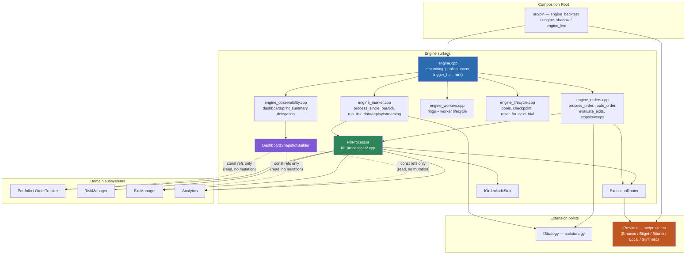
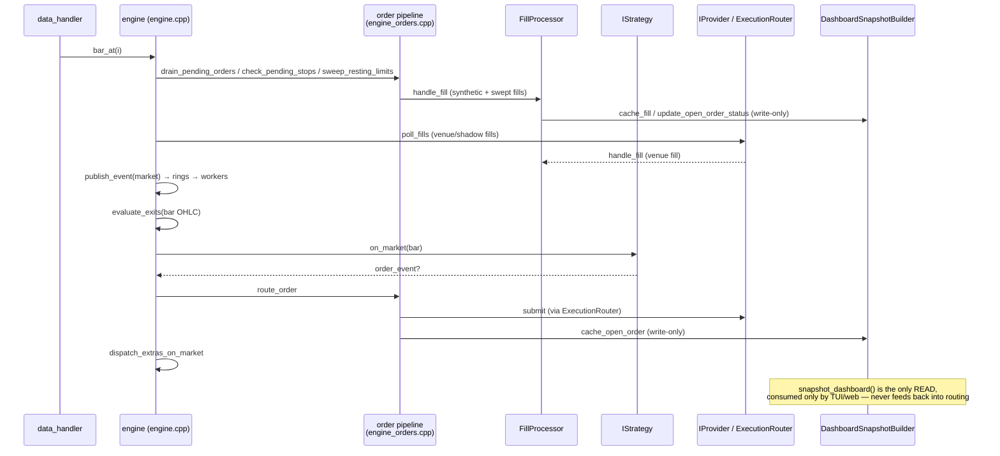

# Engine Boundaries (Phase 3: Architectural Hardening)

**Status**: Living document (2026-08-19). Produced by the engine-decomposition
Phase 3 audit; **CLOSED — PASS WITH FOLLOW-UPS** per independent final
verification (see `docs/internal/engine-decomposition.md` → "Closure"
section for the triage and evidence summary). Detailed audit evidence,
call-site tables, and the full responsibility matrix live in
`docs/internal/engine-decomposition.md` ("Phase 3: Architectural Hardening"
section) — this file is the thin, durable pointer other docs (`AGENTS.md`,
`01-target-architecture.md`) should link to.

**Target property**: *"engine.cpp is the map, not the city."* Engine
coordinates; it does not implement unrelated domain behavior.

---

## 0. Diagrams

**Component/dependency diagram** (post-Phase-3 state; arrow = "depends on"):

**Event-flow diagram** (one bar-mode iteration of `engine::run()`):

---

## 1. Invariants

These extend the invariants already enforced in `02-model.md` (anti-patterns)
and `01-target-architecture.md` (safety surface). Where a mechanical check
exists it is named; where none exists, it is enforced by review.

| # | Invariant | Enforcement |
|---|---|---|
| 1 | `engine.cpp` owns top-level orchestration only (ctor/dtor, `log_event`, `publish_event`, `trigger_halt`, kill/shutdown, `run()`). Everything else lives in a sibling `engine_*.cpp` or an extracted collaborator. | Review + `ENGINE_LOC_MAX` guard (`cmake/Sources.cmake`) |
| 2 | Generic engine/pipeline code contains no exchange-specific branching. | `check-layer-deps.sh` Check A (vendor-header leak) |
| 3 | Provider-specific behavior stays behind the `IProvider` boundary. | `check-layer-deps.sh` Check A |
| 4 | Processors depend on domain subsystems (`Portfolio`, `RiskManager`, `ExecutionRouter`, ...), not on the concrete `engine` class, unless explicitly justified. | `check-layer-deps.sh` Check B |
| 5 | Observability (dashboard, logging, metrics, audit, QuestDB) consumes state; it is never a required participant in a trading decision. | Review (see §4) |
| 6 | Canonical mutable state has exactly one owner (see §3). | Review |
| 7 | No `EngineContext` / service locator. Every collaborator dependency is a distinct, named constructor parameter. | Review |
| 8 | `RiskManager` remains the owner of generic risk policy. | Review |
| 9 | `ExecutionRouter` / the execution subsystem remains the execution boundary. | Review |
| 10 | Safety mechanisms (Kill Switch, Dead Man's Switch, reconciler, watchdog, `halt_flag_`) retain distinct semantics — never collapsed into one generic safety manager. | `check-live-safety-freeze.sh` + `02-model.md` anti-patterns |
| 11 | `TT_TARGET` compile-time live-order gating is never replaced with a runtime-only check. | `src/core/tt_target.h` + review |
| 12 | Hot-path processors (event-loop call graph: `publish_event`, `process_order`, `route_order`, `evaluate_exits`, the fill pipeline) may not allocate unless explicitly reviewed and measured. | `tests/test_hotpath_allocs.cpp`, `tests/test_hotpath_alloc_matrix.cpp` |

## 2. Dependency-direction rules

Module-level direction is enforced by `scripts/check-layer-deps.sh` (the
`ALLOWED[...]` graph). Phase 3 adds two finer-grained checks the module
graph cannot express on its own, because both violations are *within*
already-allowed module pairs:

- **Check A — vendor leak guard**: only `src/providers/` (adapter
  implementations) and `src/bin/` (composition root) may
  `#include "providers/{binance,bitget,bitunix}/..."`. Everything else —
  including `src/engine/` — may only see the generic `IProvider` /
  `IExecutionAdapter` / `IRiskCheck` interfaces. Audited clean as of
  2026-08-19 (no pre-existing violations).
- **Check B — engine-backreference guard**: a fixed, named list of
  extracted engine/ collaborator headers (`dashboard_snapshot_builder.h`,
  `execution_router.h`, `checkpoint.h`, `instrument_spec_cache.h`,
  `order_audit_sink.h`, `fill_processor.h`, `live_safety_session.h`) may not
  include `engine.h` or forward-declare `class engine`. Add a new
  collaborator header to this list the moment it is extracted (e.g. a future
  `OrderIntentProcessor` / `MarketEventProcessor` — see §5). Audited clean
  as of 2026-08-19.

Both checks are additive deny-lists over a small, explicit set of files —
not a regex sweep of the whole tree — per the existing script's own
philosophy (see its header comment).

Still enforced only by review (no mechanical check exists, and none is
proposed here as the cost/benefit did not clear the bar — see §7):

- dashboard/web code becoming a dependency of the execution/risk path (the
  existing module graph already keeps `web` and `ui` from appearing in
  `ALLOWED[execution]`/`ALLOWED[risk]`, so this would already be caught by
  the module-level check, not a gap).
- lower-level domain components (`risk`, `execution`, `exits`, ...)
  including engine orchestration headers — likewise already excluded from
  those modules' allow-lists.

## 3. State ownership matrix (major components)

| Component | Owner | Constructed | Destroyed | Hot-path? | May allocate? | Threads touching it |
|---|---|---|---|---|---|---|
| `portfolio_`, `order_tracker_`, `analytics_`, `adverse_selection_`, `risk_manager_`, `exit_manager_`, `order_meta_` | `engine` (plain members) | engine ctor | engine dtor (member order) | Yes (mutated on event loop) | No (reserved/pooled) | Event-loop thread only (writers); snapshot reader is `DashboardSnapshotBuilder` under `dashboard_view_` mutex (read-only copy) |
| Object pools (`market_pool_`, `order_pool_`, `fill_pool_`, ...) | `engine` | ctor + `prewarm_object_pools()` | dtor (with debug-mode in-use assertions) | Yes | No after prewarm (`forbid_runtime_grow`) | Event-loop thread acquires; worker threads release (drained via `drain_object_pool_returns()`) |
| `audit_sink_` (`IOrderAuditSink`) | `engine` (`unique_ptr`) | ctor (Noop, upgraded to QuestDB on `questdb_begin()`) | dtor | No (cold record calls off the allocation-tracked path) | Yes (cold) | Event-loop thread |
| `router_` (`ExecutionRouter`) | `engine` (`unique_ptr`) | ctor | dtor | Partially (resolve/submit/poll are hot; async-result draining is cold) | No on hot calls | Event-loop thread |
| `dashboard_builder_` (`DashboardSnapshotBuilder`) | `engine` (`unique_ptr`) | ctor, after `router_`/`audit_sink_` | dtor | Cache writes are on the event loop (cheap); `build_dashboard_view` is cold/debounced | Cold path only | Event loop writes caches; TUI/web poller thread reads via `snapshot_dashboard` under mutex |
| `fills_` (`FillProcessor`) | `engine` (`unique_ptr`) | ctor, after `router_`/`dashboard_builder_`/`order_meta_` are valid (destruction-order dependency — see `engine.h` comment at the `fills_` declaration) | dtor, before its dependencies | Yes (canonical fill pipeline) | No | Event-loop thread |
| `worker_watchdog_` | `engine` (`unique_ptr`, optional) | ctor, only if the provider supplies liveness sources | dtor / `stop_workers()` | No (background poll thread) | N/A | Its own thread; halt callback fires cross-thread, gated by `callbacks_armed_flag_` |
| Rings + `*_worker_` (`logging_ring_`, `risk_ring_`, ...) | `engine` | `start_workers()` | `stop_workers()` (called from dtor and before re-run in reused-engine paths) | Producer side is hot (`publish_event`); consumer side is each worker's own thread | Producer: no. Consumer: worker-specific | Event-loop thread (producer) + one thread per worker (consumer) |
| `halt_flag_` | `engine` (`atomic<bool>`) | ctor (`false`) | N/A (lives with engine) | Read on every hot-path iteration | N/A | Written only via `trigger_halt()` (single entry, `exchange(true, ...)`, terminal); read from any thread |
| `callbacks_armed_flag_` | `engine` (`shared_ptr<atomic<bool>>`) | ctor | Cleared in dtor before member teardown; kept alive by `shared_ptr` copies captured in provider/watchdog callbacks so a late callback firing after destruction still observes a valid, disarmed flag instead of touching freed memory | No | N/A | Any callback thread (read); engine thread + dtor (write) |

Shutdown ordering that matters (see `engine::~engine()`): `stop_workers()` →
`finalize_inline_event_log()` → disarm + `revoke_provider_callbacks()` →
(debug-only) pool in-use assertions → member teardown in declaration order,
which is why `fills_` is declared after everything it references.

## 4. Observability boundary

Audited 2026-08-19: every `dashboard_builder_->...` call site across
`engine_orders.cpp`, `engine_market.cpp`, `engine_fills.cpp`,
`engine_pending.cpp`, `engine_lifecycle.cpp`, and `fill_processor.cpp` is a
**write** into the snapshot cache (`cache_open_order`,
`update_open_order_status`, `erase_open_order`, `cache_fill`,
`clear_for_mc_reset`, `request_dashboard_refresh`, `refresh_if_due`). The
only **read**, `snapshot_dashboard()`, is called exclusively from
`engine_observability.cpp`, which is the public API consumed by the TUI and
web poller — nothing in the order/market/fill pipeline reads back from
`dashboard_builder_` to make a trading decision. `DashboardSnapshotBuilder`'s
constructor also only takes `const&` to the domain state it renders (see its
header) — it cannot mutate portfolio, risk, or order state.

QuestDB/audit persistence is soft-fail by default (`--persist-strict` is the
opt-in that makes a persistence failure terminal) and reached exclusively
through `audit_sink_` (`IOrderAuditSink`) — engine never inspects
`questdb_store_` for a trading decision, only for activation/tick/finalize.

Conclusion: the observability boundary already holds. No changes made; this
section documents the audit so a future contributor can trust it without
re-deriving it.

## 5. Provider extension boundary

Audited 2026-08-19 via `grep` across `src/engine/*.h` and `src/engine/*.cpp`
for venue name references: no exchange-specific branching found. The two
near-hits, both benign:

- `dashboard_snapshot_builder.cpp`: `#ifdef HAS_BINANCE` sets a display-only
  `has_binance` capability flag for the dashboard — not a trading-logic
  branch.
- `engine.h` / `engine.cpp`: two comments naming Binance OCO as the
  motivating example for the provider-driven (not mode-driven) bracket-adapter
  wiring — the code itself branches on `config_.provider->get_bracket_adapter()`
  returning non-null, not on venue identity.

The intended structure (`Engine/pipeline → IProvider → {Binance, Bitget,
Bitunix, Local/Synthetic}`) holds today. No extraction work was needed in
Phase 3; Check A above (§2) now guards it mechanically going forward.

## 6. "When do I modify Engine?"

| Change | Touch `engine.cpp`/`engine.h`? | Where it goes instead |
|---|---|---|
| New strategy | No | `src/strategy/`, self-registered via `REGISTER_STRATEGY` |
| New provider/venue | No, unless the generic `IProvider` contract itself must change | `src/providers/<venue>/` behind the existing `IProvider`/`IExecutionAdapter`/`IRiskCheck` interfaces |
| New risk rule | No | `src/risk/` (`RiskManager`, `IRiskCheck` implementations) |
| New analytics metric | No | `src/analytics/` |
| New dashboard element | No | `DashboardSnapshotBuilder` (`src/engine/dashboard_snapshot_builder.{h,cpp}`) + `src/ui/` / `src/web/` |
| New standard exit policy | No, in the normal case | `src/exits/` (`ExitManager`, `DefaultExitPolicy`) |
| New order-pipeline domain logic (e.g. a new order-lifecycle concern) | Not `engine.cpp`; likely `engine_orders.cpp` today, or a new `OrderIntentProcessor` once extracted (see §7) | `engine_orders.cpp` / future processor |
| New fundamental event category | Yes, engine change may be appropriate | `engine.cpp` (dispatch) + relevant `engine_*.cpp` |
| Change pipeline ordering (e.g. exits-before-strategy) | Yes, and requires broad regression review (golden regression, MC reuse, hotpath alloc matrix) | `engine.cpp` / `engine_market.cpp` / `engine_orders.cpp`, per the Live-Safety Freeze ritual |
| Change live safety semantics (halt, DMS, kill switch, reconciler) | Requires dedicated safety review; outside ordinary feature work | Frozen surface — see `scripts/check-live-safety-freeze.sh` |

## 7. Consciously retained technical debt

- **`OrderIntentProcessor` / `MarketEventProcessor` not yet extracted.**
  `process_order`, `route_order`, `unwind_positions`,
  `check_pending_stops`, `sweep_resting_limits`, `evaluate_exits`
  (`engine_orders.cpp`) and `process_single_bar`/`process_single_tick`
  (`engine_market.cpp`) are still `engine::` methods, not standalone
  collaborators — they are the two remaining category-E (detailed domain
  logic) blocks per the Phase 3 audit. `docs/internal/engine-decomposition.md`
  already names both as the natural next step (bottom-up from the completed
  `FillProcessor`). They were deliberately **not** attempted in this pass:
  they sit on the hot, frozen, live-safety surface (`process_order`'s
  documented "CANONICAL HOT-PATH ORDERING"), and the repo's own established
  ritual for exactly this class of change — design doc iterated to zero
  open issues, worktree isolation, a fresh reviewer subagent, full build
  matrix, golden regression, MC reuse campaign, and a clean multi-hour
  `engine_shadow` run before a two-person CCB sign-off — is exactly the
  ritual `FillProcessor` itself went through. Rushing that surface in the
  same pass as a documentation/tooling audit would violate the mandatory
  safety and performance constraints this phase was given. Today, a new
  *strategy*, *provider*, *risk rule*, *analytics metric*, *dashboard
  element*, or *standard exit policy* already does not require touching
  `engine.cpp`/`engine.h` (see §6) — extracting these two processors would
  mainly benefit contributors adding **new order-lifecycle or market-event
  handling concerns**, a narrower and rarer case.
- **`FillProcessor`'s ~19-parameter constructor.** Already flagged explicitly
  in `docs/internal/engine-decomposition.md` at extraction time as "evidence
  the responsibility is too broad," with each dependency kept as a distinct
  named reference (no bundled context object) rather than hidden. Deferred
  further split unless a future `/quality` or `/safety` review demands it.
  See `docs/internal/engine-decomposition.md` "Phase 2: Domain Processor
  Extraction" for that note.
- **`engine_market.cpp` at 1692 LOC** is now the largest single translation
  unit in the engine surface — larger than `engine.cpp` itself. It is
  `engine::` method bodies (run-loop pumps + bar/tick/L2 dispatch), not a
  god class in the god-class sense (no unrelated responsibilities crammed
  in), but it is the next-best candidate if further file-size hygiene is
  wanted, and would substantially shrink automatically once
  `MarketEventProcessor` is extracted per the note above.

---

**See also**: `docs/internal/engine-decomposition.md` (full audit evidence,
Phase 0-3 history), `01-target-architecture.md` (system-wide invariants),
`02-model.md` (anti-patterns + AI-assistant model policy),
`docs/skills/engine-as-service-boundary.md` and
`docs/skills/phase-ritual-enforcer.md` (planning docs for guardian skills
that would actively enforce parts of this document, not yet implemented).
