# TrueTest Engine — Complete Program Flowchart

## 1. Top-Level Entry Flow

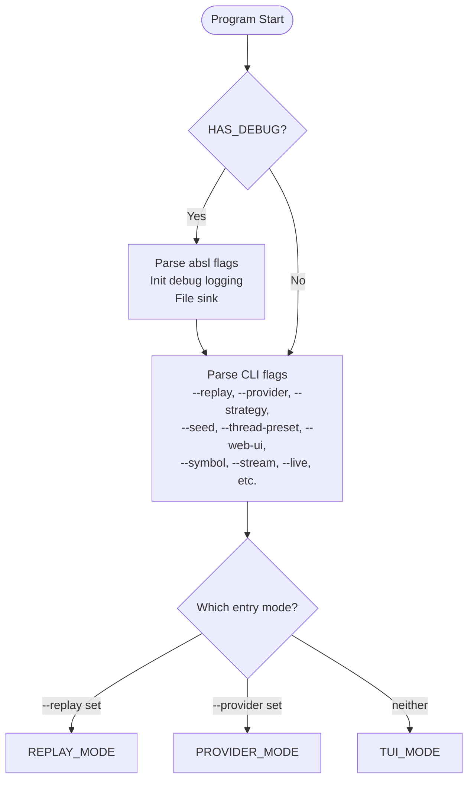

## 2. Replay Mode

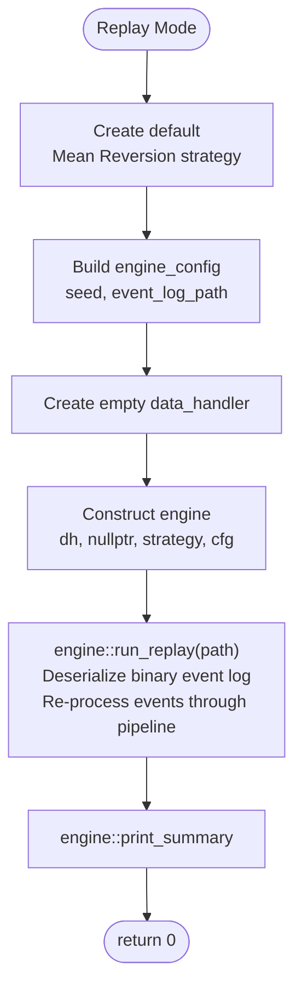

## 3. Provider Mode (CLI)

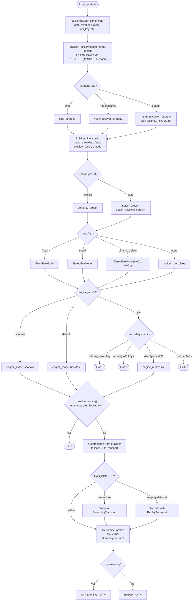

## 4. Streaming Path (Provider Mode)

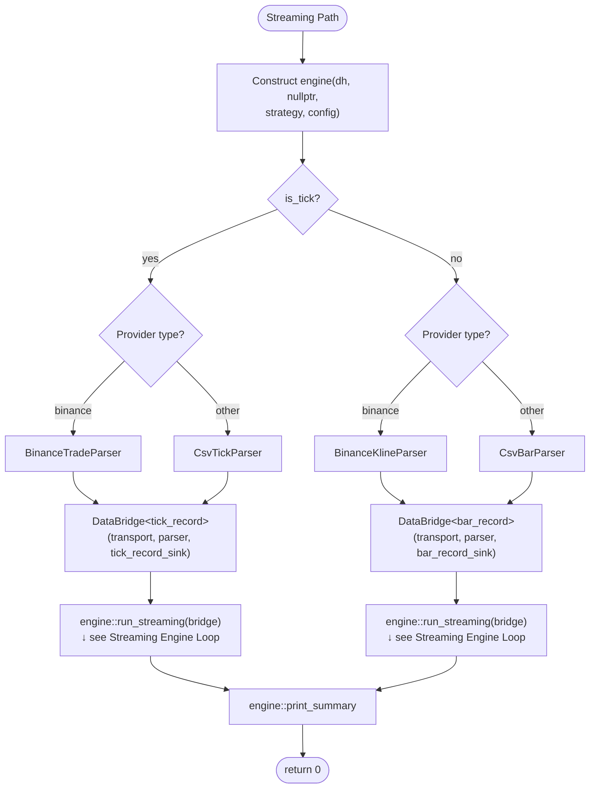

## 5. Batch Path (Provider Mode)

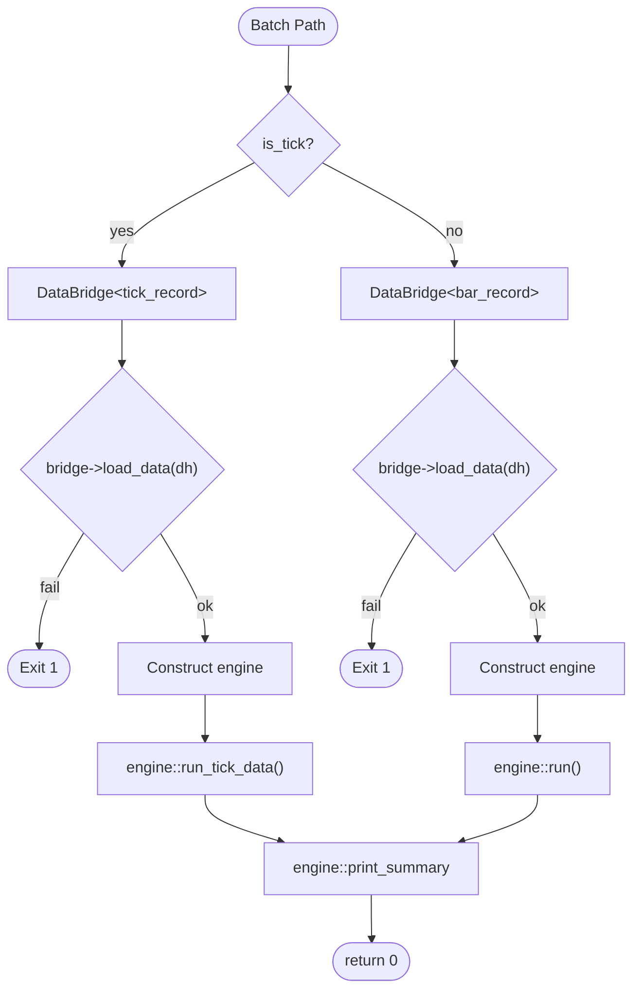

## 6. TUI Mode (Interactive)

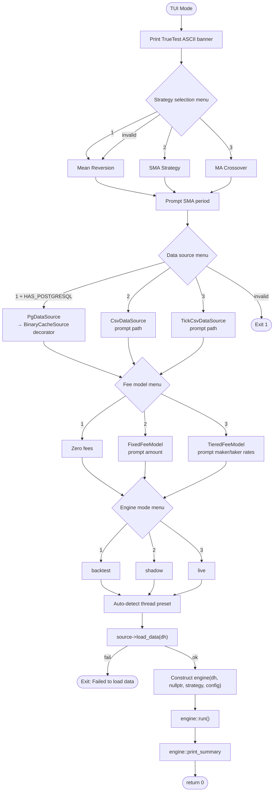

## 7. Engine Constructor

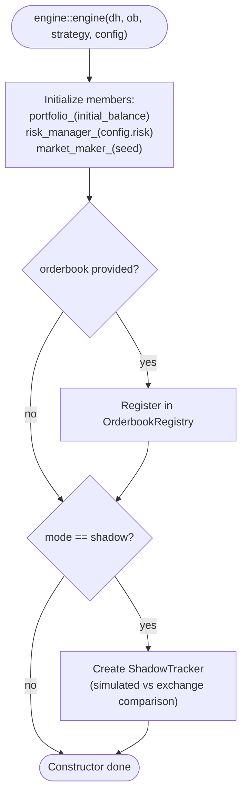

## 8. engine::run() — Batch Bar Loop

```mermaid
flowchart TD
    RUN(["engine::run()"]) --> RUN_CHECK{has_tick_data?}
    RUN_CHECK -->|yes| DISPATCH_TICK["run_tick_data() — see below"]
    RUN_CHECK -->|no| BAR_CHECK{has_bar_data?}
    BAR_CHECK -->|no| RUN_ERROR([throw: no data loaded])
    BAR_CHECK -->|yes| INIT_LOG{event_log_path set?}

    INIT_LOG -->|yes| CREATE_LOGGER[Create EventLogger]
    INIT_LOG -->|no| DEBUG_MEM
    CREATE_LOGGER --> DEBUG_MEM

    DEBUG_MEM["DEBUG: capture memory baseline"] --> START_WORKERS["start_workers()<br/>↓ see Worker Startup"]

    START_WORKERS --> WS_STATUS["WEB_UI: broadcast 'running' status"]
    WS_STATUS --> BAR_LOOP

    BAR_LOOP["FOR each bar i = 0..N"]
    BAR_LOOP --> HALT_CHK{halt_requested OR<br/>halt_flag_ OR<br/>worker_failed_?}
    HALT_CHK -->|yes| LOOP_END
    HALT_CHK -->|no| CREATE_MKT["Create market_event from<br/>data_handler columns:<br/>symbol, OHLCV, timestamp"]

    CREATE_MKT --> DRAIN_PENDING["Drain pending orders<br/>(priority queue by eligible time)"]
    DRAIN_PENDING --> UPDATE_MID["last_mid_price_ = close"]

    UPDATE_MID --> CHECK_STOPS["Check pending stop orders<br/>Buy stops: high >= stop_price<br/>Sell stops: low <= stop_price<br/>→ Convert to market/limit order"]

    CHECK_STOPS --> REPLENISH["MarketMaker::replenish(orderbook, mid_price)<br/>(skip if MM worker active)"]

    REPLENISH --> PROCESS_MKT["Publish market_event<br/>to rings + analytics"]

    PROCESS_MKT --> STRAT_CALL["strategy->on_market(mkt)<br/>→ optional order_event"]

    STRAT_CALL --> HAS_ORDER{order returned?}
    HAS_ORDER -->|no| MM_ORDERS
    HAS_ORDER -->|yes| ORDER_TYPE{order type?}

    ORDER_TYPE -->|stop / stop_limit| ADD_STOP["Add to pending_stops"]
    ORDER_TYPE -->|market / limit<br/>with latency| QUEUE_PENDING["Push to pending_orders<br/>(min-heap by eligible_ts)"]
    ORDER_TYPE -->|market / limit<br/>no latency| PROCESS_NOW["process_order()<br/>↓ see Order Pipeline"]

    ADD_STOP & QUEUE_PENDING & PROCESS_NOW --> MM_ORDERS

    MM_ORDERS{extended preset?}
    MM_ORDERS -->|yes| MM_DRAIN["Drain mm_order_ring_<br/>Process MM replenish orders"]
    MM_ORDERS -->|no| DAY_CHECK

    MM_DRAIN --> DAY_CHECK
    DAY_CHECK["Check day orders for<br/>end-of-session cancellation"]

    DAY_CHECK --> WS_CMDS["WEB_UI: process_ws_commands<br/>broadcast_orderbook_snapshot<br/>send_state_snapshot"]

    WS_CMDS --> PROGRESS["Print progress every 200ms"]
    PROGRESS --> BAR_LOOP

    LOOP_END["Flush pending orders queue<br/>Cancel open day orders"] --> FLUSH_LOG["Flush event logger"]
    FLUSH_LOG --> DEBUG_REPORT["DEBUG: print stage timer,<br/>memory, ring diagnostics"]
    DEBUG_REPORT --> STOP_WORKERS["stop_workers()<br/>↓ see Worker Shutdown"]
```

## 9. engine::run_tick_data() — Batch Tick Loop

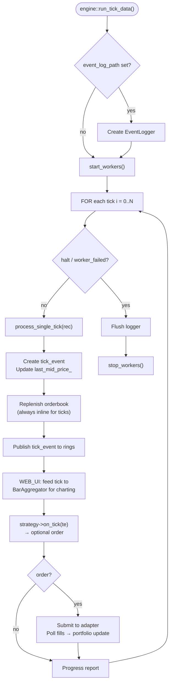

## 10. Streaming Engine Loop

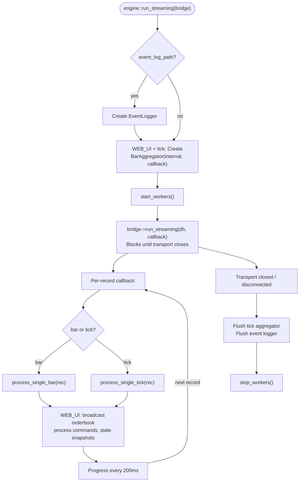

## 11. Order Processing Pipeline (process_order)

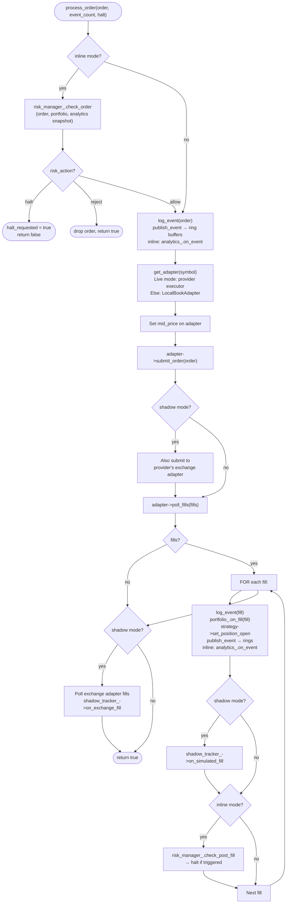

## 12. Execution Adapter Resolution

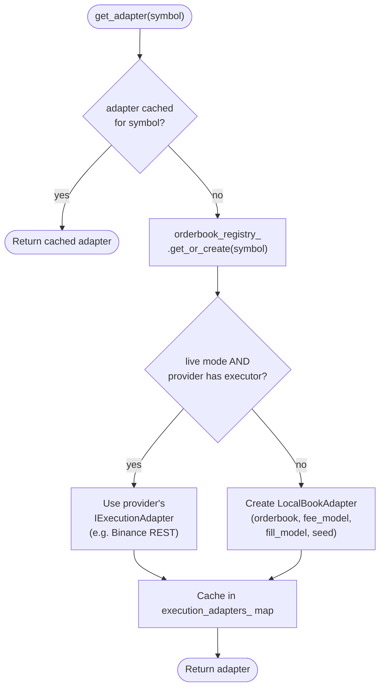

## 13. Worker Thread Startup

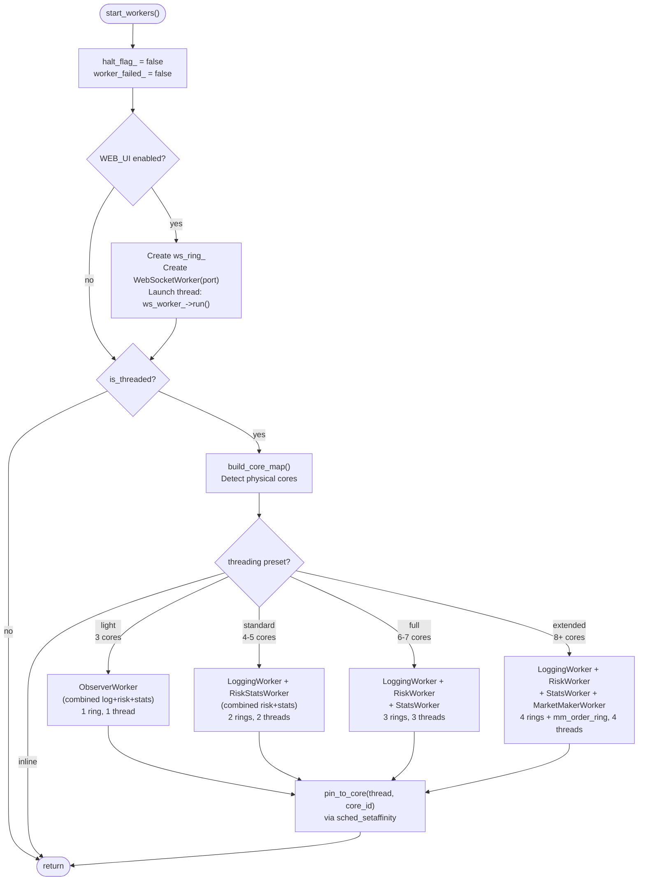

## 14. Worker Thread Shutdown

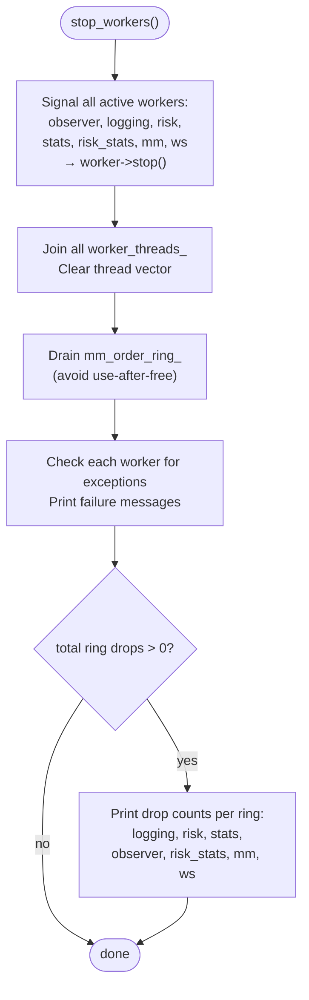

## 15. Event Publishing (Hot Path)

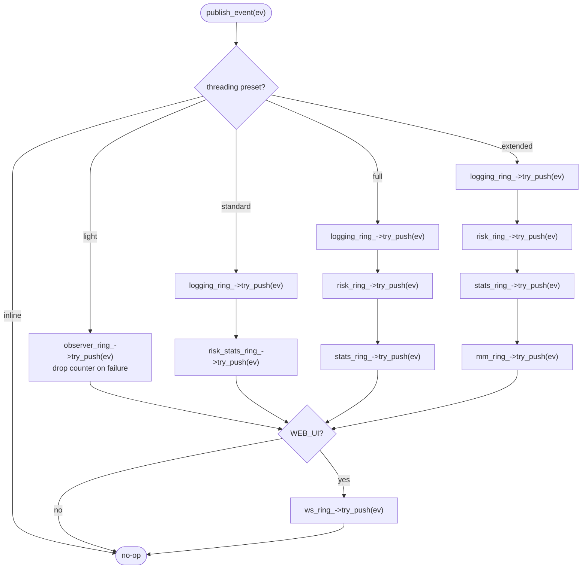

## 16. Print Summary & Exit

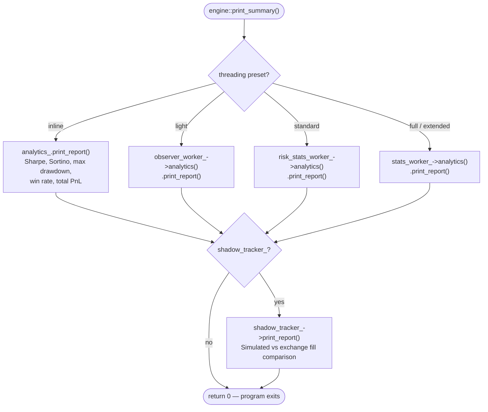

## 17. Complete Event Pipeline (Single Bar)

```mermaid
flowchart LR
    subgraph Data
        BAR["bar_record<br/>(OHLCV + symbol)"]
    end

    subgraph Engine Core 0
        MKT["market_event"]
        OB["Orderbook<br/>replenish"]
        STRAT["IStrategy<br/>::on_market()"]
        ORD["order_event"]
        ADAPTER["IExecutionAdapter<br/>::submit_order()"]
        FILL["fill_event"]
        PORT["Portfolio<br/>::on_fill()"]
    end

    subgraph "Worker Threads (SPSC Rings)"
        LOG["LoggingWorker<br/>binary + text log"]
        RISK["RiskWorker<br/>shadow portfolio<br/>halt_flag_"]
        STATS["StatsWorker<br/>Welford online algo<br/>Sharpe/Sortino"]
        MM["MarketMakerWorker<br/>replenish orders"]
        WS["WebSocketWorker<br/>JSON broadcast"]
    end

    subgraph Browser
        UI["web/index.html<br/>equity curve<br/>orderbook depth<br/>fills table"]
    end

    BAR --> MKT
    MKT --> OB
    OB --> STRAT
    STRAT --> ORD
    ORD --> ADAPTER
    ADAPTER --> FILL
    FILL --> PORT

    MKT -.->|publish| LOG & RISK & STATS & MM & WS
    ORD -.->|publish| LOG & RISK & STATS & MM & WS
    FILL -.->|publish| LOG & RISK & STATS & MM & WS

    MM -.->|mm_order_ring_| Engine Core 0
    WS -->|WebSocket JSON| UI
    RISK -.->|halt_flag_| Engine Core 0
```
