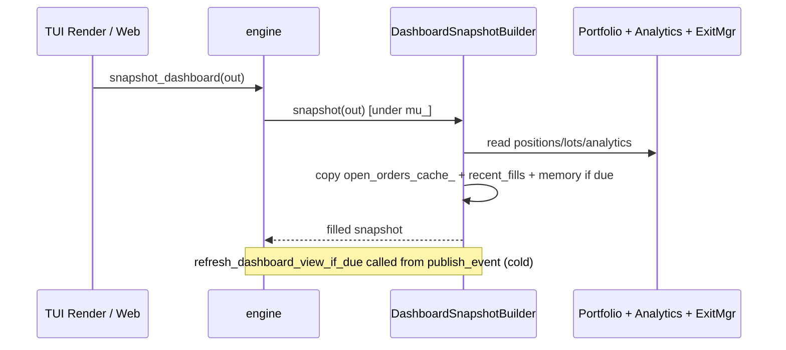
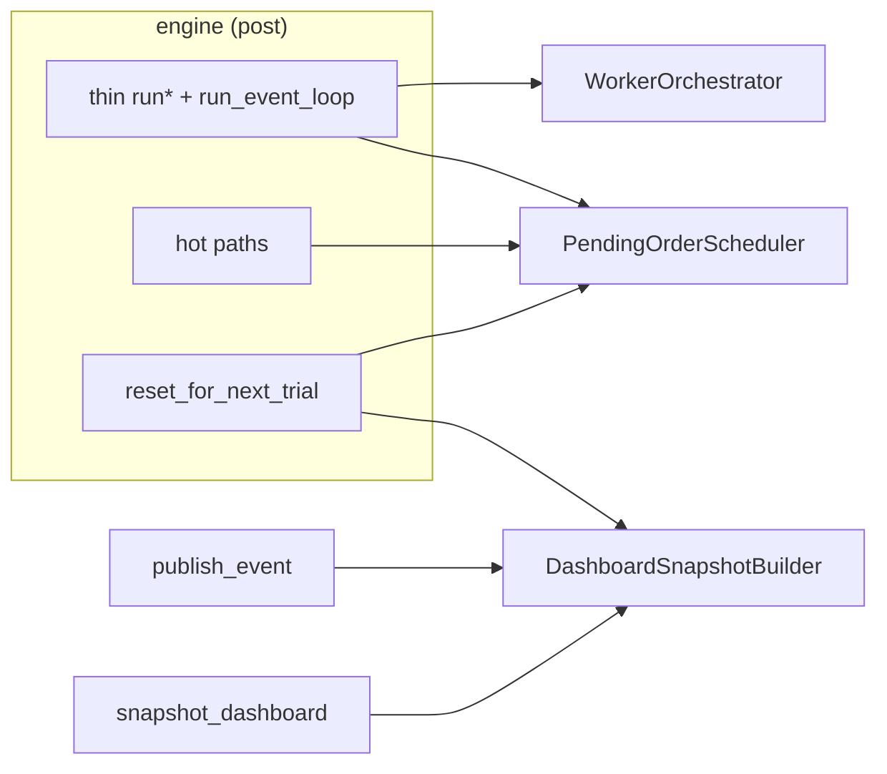

# Engine God Class Decomposition — Phase 1 Design Document

**Title**: Phase 1 Design: Engine Decomposition (Waves 1-5 per core/docs/internal/engine-decomposition.md)
**Author**: Grok (systems architect, delegated build subagent)
**Date**: 2026-07-17
**Status**: Draft (Phase 1 output; awaiting approval before any implementation)
**Inputs**: core/docs/internal/engine-decomposition.md (Current State After Phase 0 section, responsibility matrix, Phased Execution Plan Waves 1-5), ~/.grok/skills/engine-decomposition/SKILL.md (all non-negotiables), src/engine/engine.{h,cpp}, core/docs/governance/01-prod.md, 02-prerequisites.md, core/docs/todos/02-P1-freeze.md, core/docs/architecture/04-performance.md, extracted seams (order_audit_sink.{h,cpp}, execution_router.{h,cpp}, instrument_spec_cache.{h,cpp}, checkpoint.{h,cpp}).

**Related**: Addresses core/docs/internal/engine-decomposition.md#E-10 to E-14 (Phase 1: Design First + Executable PR Plan). Will be referenced to update engine-decomposition.md with DAG.

---

## Overview

The `engine` class (`src/engine/engine.h:82`, `src/engine/engine.cpp:4383` LOC / `engine.h:492` LOC as of Phase 0 baseline) is a god class owning hot event-loop dispatch (`publish_event`, `process_order` canonical 8-step sequence), object pools, four duplicated `run*()` skeletons, cold dashboard snapshot construction with caches, pending order scheduling (priority_queue + vector stops), worker/ring lifecycle, QuestDB activation, safety flags, attribution, exits integration, and MC reuse via `reset_for_next_trial`.

Phase 1 of the Engine Decomposition Plan (following the exact Waves 1-5 in core/docs/internal/engine-decomposition.md) proposes extracting **cold paths first** into focused collaborators while **preserving identical bit-for-bit behavior** for backtest/shadow/live (all `TT_TARGET` / `ENABLE_*` combos), MC object reuse, golden regressions, hot-path alloc tests, and engine integration tests. Hot path remains zero-alloc, no virtuals, lock-free SPSC rings, `acquire_pooled` + `publish_event` + `forbid_runtime_grow` discipline unchanged forever.

**Proposed target after all waves**:
- `engine.cpp` <1800 LOC (stretch 1200-1500).
- `engine.h` significantly smaller (private details behind forward decls or pimpl where safe; public contracts identical).
- New files under `src/engine/`: `dashboard_snapshot_builder.{h,cpp}`, `pending_order_scheduler.{h,cpp}`, `worker_orchestrator.{h,cpp}` (and thin `run_event_loop` skeleton or `EventLoopCoordinator` if extraction leverage justifies).
- Existing complete seams (`IOrderAuditSink`, `InstrumentSpecCache`, and
  `CheckpointManager`) remain the model. `ExecutionRouter` is partial today:
  engine still bypasses it for async submit results, exchange-shadow dual
  submission, and some provider-fill paths; those bypasses must be extracted
  before it can be called complete.

Net complexity reduction via deletion of duplicated run skeletons, scattered cache logic, and ad-hoc pending handling — not mere relocation.

---

## Background & Motivation

**Current state (post-Phase 0, 2026-07-17)**:
- Baseline: `wc -l` reports 4383/492 (confirmed via tool).
- Already-extracted good seams reduce some bloat (see responsibility matrix in engine-decomposition.md:409).
- Remaining bloat sources (engine-decomposition.md:34):
  - Four `run*()` methods (`run()` ~line 3758, `run_tick_data()` ~4018, `run_replay()` ~4219, `run_streaming` overloads ~3284/3436/3575) with near-identical skeletons: pending clear, questdb_begin, start_workers, pin, event loop + pending drain + check_pending_stops + dispatch + teardown (stop_workers + questdb_end).
  - `build_dashboard_view` (~561) + `refresh_dashboard_view_if_due` (~486), `cache_*` (~510-560), `open_orders_cache_` (unordered_map<uint64_t, open_order_cache_entry> at engine.h:210), `recent_fills_cache_` (deque), memory_cache_ (~199), snapshot/request APIs. Largest cold method; used by TUI render thread (via `snapshot_dashboard` at engine.h:469) and web poller.
  - Pending scheduling: `pending_orders_` (priority_queue<pending_entry, ..., decltype(&engine::pending_cmp)> at engine.h:310), `pending_stops_` (vector at 294), `day_order_ids_`, `order_seq_`, `check_pending_stops` (~2615), registration in `route_order`.
  - Worker/ring: `start_workers()` (~1279), `stop_workers()` (~1492), `make_logging_worker()`, all `* _ring_`, `* _worker_` unique_ptrs (engine.h:350), drop counters, pinning.
  - Scattered: `stamp_fill_attribution`, `dispatch_*`, `notify_position_change_all`, `write_adapter_diagnostics`, `unwind_positions`, meta lookups (some already partially routed via router_).
- Hot vs cold classification (engine-decomposition.md:381): `acquire_pooled`/`publish_event`/`process_order`/`route_order`/`evaluate_exits`/`trigger_halt` sacred. Dashboard + run duplication + workers + pending = high-LOC cold targets.
- Call sites (engine-decomposition.md:429): src/simulation/monte_carlo_controller.cpp (reset + run variants), tests (test_hotpath_*, test_golden_regression, test_engine_*, test_monte_carlo_controller), src/api/truetest_api.cpp, providers (event_publisher, halt_callback, funding_factory via acquire_pooled), TUI/web (snapshot + request_refresh + ring getters), exit_manager callbacks.
- Pain: Continued direct growth risks spaghetti. Duplication defeats determinism/maintainability. Header pollution exposes cold state.

**Why now**: Phase 0 complete + signed off (engine-decomposition.md:450). Follows engine-decomposition skill mandates. Aligns with P1 freeze (`docs/todos/02-P1-freeze.md` P1-02 references engine-decomposition.md plan), 01-prod.md (LIVE-SAFETY SURFACE), 02-prerequisites.md, architecture/04-performance.md (zero-alloc rules).

---

## Goals & Non-Goals

**Goals (non-negotiable, per SKILL.md + engine-decomposition.md)**:
- **Net complexity reduction**: Delete duplicated skeletons, concepts, branches (e.g. per-mode run setup), not just move. Target line counts per engine-decomposition.md table.
- **Identical functionality**: Bit-for-bit for backtest/shadow/live + all ENABLE combos + MC `reset_for_next_trial` reuse + golden + alloc matrix + integration tests + real runs.
- **Zero-alloc hot path discipline forever**: Preserve exactly `prewarm_object_pools`, `drain_object_pool_returns`, `acquire_pooled<T>`, `forbid_runtime_grow`, all `*_pool_`, `publish_event`, rings, no heap/string/json/vector growth on event loop. No new virtuals on hot paths.
- **Contract preservation**: `run*()`, `reset_for_next_trial(uint64_t)`, `snapshot_dashboard(...)`, `trigger_halt(string_view)`, ring getters (`get_*_ring`), `get_*_worker`, operator controls (`set_pause_all`, `request_flatten`, `cancel_order` etc.), `get_halt_flag`, public analytics/portfolio access remain behaviorally identical.
- **LIVE-SAFETY SURFACE compliance**: `engine.{h,cpp}` frozen. Every change (even prep comments) requires `LIVE_SAFETY_CCB_APPROVED` token, `./scripts/check-live-safety-freeze.sh`, two-person CCB + ≥4h clean `engine_shadow`. See 01-prod.md, 02-prerequisites.md, SKILL.md §1.
- **QuestDB/audit single seam**: All record_* exclusively via `audit_sink_` (IOrderAuditSink). No raw `questdb_*` decision sites for data capture in engine (ctor wiring minimal). Noop remains cheap. See order_audit_sink.h:19 contract.
- **Layering/tooling**: Pass `check-layer-deps.sh` (engine allowed deps include new peers under engine/ but no upward). Hotpath JSON clean.
- **Safety never weakened**: `halt_flag_` terminal (exchange true), `trigger_halt` single entry, reconciler default-refuse, etc.
- Enable full verification ritual (check-work, performance, quality, safety, long engine_shadow, MC, golden).

**Non-Goals**:
- No changes to hot sacred paths (`process_order` canonical sequence at engine.cpp:1988, `route_order`, `acquire_pooled` template at engine.h:147, pools, `publish_event`).
- No new public API surface or behavioral changes to MC reuse, TUI snapshot data, or run outputs.
- Do not touch object pools, `publish_event` ring handoff, worker ring wiring in hot paths, or safety primitives.
- Not a full lifecycle coordinator in Phase 1 (future post-Wave 5).
- No implementation until this design approved (per Phase 1 exit criteria).
- No broad filesystem searches or out-of-scope refactors.

---

## Proposed Design

Follow **exact phased plan** in core/docs/internal/engine-decomposition.md (Phases 0 done, then Phase 2 prep, Waves 1-5). Cold-first order: dashboard (highest leverage cold, ~350-500 LOC) before run duplication or pending (which have hot-path call sites).

**Target layout after Waves** (before/after responsibilities):

```mermaid
graph TD
    subgraph "Before (current god class)"
        E[engine<br/>4383 cpp / 492 h]
        E -->|owns| DB[dashboard state + build]
        E -->|dupe| R[4x run* skeletons]
        E -->|owns| PS[pending pq + stops + check]
        E -->|owns| WO[rings + workers + start/stop/pin]
        E -->|sacred| HP[hot: pools, publish_event, process_order, route, evaluate_exits, trigger_halt]
        E -->|delegates| AS[audit_sink_ IOrderAuditSink]
        E -->|delegates| ER[router_ ExecutionRouter]
    end

    subgraph "After (target post-Wave 5)"
        E2[engine<br/><1800 cpp, lean h]
        E2 -->|owns sacred| HP
        E2 -->|owns| AS
        E2 -->|owns| ER
        E2 -->|owns| CM[checkpoint_mgr_]
        E2 -->|owns| ISC[instrument_spec_cache_]
        E2 -->|delegates| DSB[DashboardSnapshotBuilder<br/>unique_ptr]
        E2 -->|delegates| EL[run_event_loop / thin EventLoopCoordinator]
        E2 -->|delegates| POS[PendingOrderScheduler<br/>unique_ptr]
        E2 -->|delegates| WO2[WorkerOrchestrator<br/>unique_ptr]
    end
```



**Module boundaries** (new classes are cold/utility, engine retains ownership of hot + config + core state like portfolio_/analytics_/risk_manager_/exit_manager_/order_tracker_ + strategy wiring):

- **DashboardSnapshotBuilder** (Wave 1): Pure builder + caches. No hot coupling. Receives const refs to portfolio, analytics, exit_manager, adverse_selection, halt_flag, config, last_mid_price, open_orders etc. at build time. `build_dashboard_view` becomes its method.
- **PendingOrderScheduler** (Wave 3): Owns pq + vector + seq + cmp + day_order_ids_ + expiry sweep logic. Interface: `schedule(...)`, `drain_due(timestamp, handler)`, `check_stops(high,low,ts,handler)`, `register_day_order`, `sweep_day_orders`, `clear_for_reset()`, `size()` for debug. Called from route_order (hot) and run loops/process_single_* (hot) but impl stays allocation-free on calls (acquire still in engine).
- **WorkerOrchestrator** (Wave 4): Owns ring creation, worker unique_ptrs + threads, drop counters, make_*_worker, start/stop, pinning logic (via thread_config). Forwards getters. Engine wires rings to workers via orchestrator.
- Run methods (Wave 2): Collapse to thin `run()`, `run_tick_data()` etc. that do mode-specific setup + call shared private `run_event_loop(std::function<data_source> or bridge)` or small `EventLoopCoordinator`. Eliminate duplicated pending-clear / questdb / workers / final-drain code. Start with private methods for minimal surface.

**Per-wave exact moves** (cited from current code; see engine.h:189 for dashboard state block, engine.cpp:3758 for run skeletons):

**Phase 2 (Prep, minimal low-risk)**:
- Update top-of-file LIVE-SAFETY comments + all strategic method comments (publish_event, process_order canonical seq, reset, run*) to reference core/docs/internal/engine-decomposition.md + engine-decomposition skill.
- Preserve the complete audit seam and characterize the current partial router
  boundary; do not claim router completion until its direct engine bypasses are
  extracted and tested.
- Add any thin forwarding accessors if needed for future (e.g. `get_portfolio_for_snapshot()` const ref — but prefer passing at construction of builder).
- No net LOC reduction expected.
- Run gates (see verification).

**Wave 1: DashboardSnapshotBuilder (E-30 to E-36)**:
- New: `src/engine/dashboard_snapshot_builder.h`, `.cpp`.
- Move state (engine.h:189-230):
  - `dashboard_view_mu_`, `dashboard_view_`, `dashboard_view_initialised_`, `dashboard_view_last_`, `dashboard_view_force_`
  - `memory_cache_`, `memory_cache_last_`, `memory_cache_initialised_`, `dashboard_view_interval_`
  - `struct open_order_cache_entry` (h:210)
  - `open_orders_cache_`, `recent_fills_cache_`, `kRecentFillsCap`
  - Methods: `refresh_dashboard_view_if_due`, `build_dashboard_view`, `cache_open_order`, `update_open_order_status`, `erase_open_order`, `cache_fill`, `snapshot_dashboard`, `request_dashboard_refresh`.
- Impl: Builder ctor takes necessary non-owning refs for snapshot construction and cache mutation: `portfolio_`, `analytics_`, `exit_manager_`, `adverse_selection_`, `halt_flag_` (atomic ref), `config_`, `last_mid_price_` (double&), `last_mark_symbol_` (string&), `orderbook_registry_` (for some debug), `audit_sink_` (for questdb health in snapshot), plus ring diags/pool stats via thin accessors or direct in W1 (will be delegated post W4). `build(...)` populates snapshot identically (exact copy of current logic at cpp:561, including queue stats collection, lots, brackets from exit_manager_.snapshot_armed(), memory sampling at ~1Hz).
- In engine: `std::unique_ptr<DashboardSnapshotBuilder> dashboard_builder_;` (header, forward decl). Delegate `snapshot_dashboard` / `request...` / call in `publish_event` (cpp:354) + any debug paths.
- Update all internal cache mutation call sites in engine.cpp (from canonical sequence in process_order at cpp:1988 and route/fill paths): categories include (a) route_order submit (cache_open_order + update "submit_pending"), (b) fill processing (cache_fill + erase/partial update ~10 sites in process_order + async results), (c) cancel/amend paths (update "cancel_pending" + erase), (d) close orders from exits, (e) provider/async drain fills in process_single_bar/tick (~3215). All become `dashboard_builder_->cache_open_order(...)` etc. (non-virtual methods; identical locking/mutation semantics and no alloc change on event loop).
- Remove moved code. Update TUI/web/tests call sites (they go through public `snapshot_dashboard` — no change).
- Net reduction: ~350-500 LOC in engine.cpp + header shrinkage.
- Mermaid for data flow:



**Wave 2: Run methods refactor / EventLoopCoordinator (E-40 to E-44)**:
- Identify common skeleton (drain_pools, pending drain, process_single, check_pending, evaluate_exits, dispatch_extras, checkpoint, dashboard tick, worker handoff, halt checks, progress/report, final flush/stop/questdb_end).
- First: extract private `void run_event_loop(...)` or thin coordinator class (decide per leverage: private methods preferred initially to limit surface on frozen file).
- Refactor each run_* to:
  - Mode-specific init (data_handler load, replayer, bridge setup, bar_agg, resolve_ts lambdas).
  - Clear pending (will delegate to scheduler in Wave 3).
  - questdb_begin / start_workers / pin (will move to orchestrator).
  - Call shared loop.
  - Teardown.
- Delete duplicated code paths (timestamp stepping, event_count, last_report, halt_requested).
- Preserve exact: use_csv_dates logic, bar vs tick vs provider::event visit, replay path must still call route+process.
- Expected: 300-500 LOC reduction via dedup.

**Wave 3: PendingOrderScheduler (E-50 to E-53)**:
- New: `src/engine/pending_order_scheduler.h`, `.cpp`.
- Own: `pending_orders_`, `pending_stops_`, `pending_cmp`, `day_order_ids_`, `order_seq_`, `check_pending_stops`, registration helpers, remove-from-stops on cancel. **Decision**: day_order_ids_ + the end-of-run expiry sweep logic (currently at run() ~3959 and run_replay ~4366: for each entry do orderbook_registry_.get(symbol)->cancel_order(oid); note: *not* in unwind_positions) are moved into the scheduler (not left in engine as run-lifecycle state). This centralizes all pending/day TIF state and eliminates duplication of day-order registration.
- Interface (minimal, no allocs):
  ```cpp
  // In scheduler.h (cold)
  class PendingOrderScheduler {
  public:
      void schedule(const std::shared_ptr<order_event>& o, bool is_stop);
      void drain_due(std::chrono::system_clock::time_point now,
                     std::function<void(std::shared_ptr<order_event>&, bool& halt)> processor);
      void check_stops(double high, double low, std::chrono::system_clock::time_point ts,
                       std::function<void(std::shared_ptr<order_event>&, bool& halt)> processor);
      void clear_for_reset();
      void clear_day_orders();
      void register_day_order(const std::string& symbol, uint64_t id);
      void sweep_day_orders(OrderbookRegistry& reg);  // performs end-of-run TIF day expiry cancels via ob->cancel_order
      size_t pending_count() const;
      size_t day_order_count() const;
      // ...
  private:
      // move the pq + vector + static cmp + seq + day_order_ids_ here
  };
  ```
- Wire: route_order (cpp:2589-2611; use register_day_order for tif==day), check_pending (2615), process_single_bar/tick (3038,3235; via drain), all run loops (drain + clears at start), cancel paths (remove stops), reset_for_next_trial (clear), and end-of-run() / run_replay() (call sweep_day_orders(orderbook_registry_)). 
- Critical: identical ordering/eligibility (pq cmp uses earliest_eligible_ts + seq for determinism). MC/golden must match exactly. Day TIF expiry sweep behavior identical.
- Engine retains `pending_*`? No: move ownership; provide thin accessors only for debug snapshot (or move debug too). Add verification exercising day TIF orders in golden regression + MC reuse campaigns.

**Wave 4: WorkerOrchestrator (E-60 to E-63)**:
- New: `src/engine/worker_orchestrator.h`, `.cpp`.
- Own: all `*_ring_`, `*_worker_` unique_ptrs, `worker_threads_`, drop counters (logging_drops_ etc.), `make_logging_worker`, start_workers (full 1279-), stop_workers (1492-), pin_to_core / find_core / build_core_map logic, wire_failure.
- Interface:
  ```cpp
  class WorkerOrchestrator {
  public:
      explicit WorkerOrchestrator(const engine_config& cfg, std::atomic<bool>& halt, ...);
      void start();  // does the switch on threading preset
      void stop();
      std::shared_ptr<EventRing> get_logging_ring() const;
      // ... all getters
      void clear_drops_for_debug(...); // or expose stats
  private:
      // rings, workers, threads, counters
  };
  ```
- Keep public ring/worker getters on engine for backward compat (TUI, workers, tests, debug) — forward to orchestrator.
- Thread pinning, spin policy, failure flags, shutdown callback revocation unchanged.
- MC dtor paths + reuse exercised.

**Wave 5: Polish + header shrink (E-70 to E-75)**:
- Move remaining: `stamp_fill_attribution`, `dispatch_fill_to_strategy`, `notify_position_change_all`, `write_adapter_diagnostics`, `unwind_positions`, lookup_opener/strategy_name, register_order_meta, register_strategy_exit_intent, drain_* (some may stay or go to router/exit).
- Shrink engine.h: forward decls for new classes + ui::dashboard_snapshot, move private structs/impl details, pimpl for cold state if feasible without hot impact.
- Tighten ENGINE_LOC_MAX guard in cmake if justified (with waiver comment).
- Audit dynamic_cast ladders (already reduced via router_).
- Update docs (reference, architecture, todos, this plan).
- Final LOC targets.

**Before/after module diagram** (high level):



## Key Decisions

1. **Cold-first (Wave 1 dashboard)**: Highest LOC leverage with zero hot-path risk. Matches plan. Dashboard refresh called from publish but is debounced/cold (no allocs added).
2. **Private methods first for Wave 2**: Per plan note + SKILL caution on frozen surface. Full coordinator class only if duplication deletion justifies extra seam.
3. **Scheduler owns state + exposes functional hooks**: Allows hot callers (route, process_single) to remain unchanged in call pattern while centralizing pq logic + cmp. Preserves seq determinism.
4. **Delegation via unique_ptr not inheritance**: Matches existing seams (audit_sink_, router_, instrument_spec_cache_, checkpoint_mgr_). No virtual hot cost.
5. **No change to reset contract**: Scheduler/builder/orchestrator provide `clear_for_reset()` / partial resets; engine reset_for_next_trial calls them + existing clears. Comment in h:438 documents current (rings/workers mostly untouched).
6. **Debug state surface**: Some debug (pending sizes in snapshot debug_view) will query new owners; identical values.
7. **day_order_ids_ + sweep moved fully (Wave 3 decision)**: Centralizes TIF handling and eliminates registration duplication across run paths; sweep exposed via scheduler for end-of-run calls (see Wave 3).
8. **Layering**: New files live in engine/ module (ALLOWED[engine] includes self-peers). New headers included only from engine.cpp/h as appropriate; check-layer-deps will enforce.

**Risks** (severity + mitigation, tied to invariants):
- **High: Behavior divergence in run paths or pending ordering (MC/golden breakage)**: Severity critical. Mitigation: per-wave golden regression + full MC reuse campaign + identical output compare (reports, event logs, portfolio state). Exhaustive pending tests.
- **High: Accidental hot-path alloc/virtual or pool discipline break**: Severity critical (SKILL absolute). Mitigation: never touch pools/acquire/publish/process_order in extractions; hotpath alloc matrix + zero-alloc-perf-auditor + check-hotpath-json after every wave. Pre-warm stays in engine.
- **Med: LIVE_SAFETY violation on engine.{h,cpp}**: Severity high. Mitigation: design mandates token + script + shadow in every impl wave; no source edits until design approved. Use worktrees.
- **Med: TUI/web snapshot data mismatch or perf regression**: Severity med. Mitigation: explicit before/after snapshot equivalence test or manual compare; builder produces identical struct.
- **Low: Layer-deps or include cycles**: Mitigation: design uses forward decls + ref injection like ExecutionRouter ctor (h:30).
- **Low: Net reduction not achieved**: Mitigation: track wc -l + git diff --stat per wave; delete dupe not relocate.

---

## API / Interface Changes

**No public API changes**. All contracts preserved (see Goals).

Internal before/after (example delegation):

```cpp
// Before (engine.h)
bool snapshot_dashboard(truetest::ui::dashboard_snapshot& out) const;
void request_dashboard_refresh();

// After (engine.h, public surface identical)
bool snapshot_dashboard(...) const { return dashboard_builder_->snapshot(out); }
void request_dashboard_refresh() { dashboard_builder_->request_refresh(); }
```

For scheduler (example call site preservation in route_order):

```cpp
// Before
pending_orders_.push(...); ...
// After (in Wave 3)
scheduler_->schedule(acquire_pooled(...), false);
```

Getters on engine remain (forward or thin wrappers).

---

## Data Model Changes

None for persisted data or public schemas. Internal:
- State ownership moves (e.g. open_orders_cache_ moves to builder; pending_* to scheduler). Reset paths updated to call clear on owners.
- `pending_cmp` becomes member of scheduler (static or lambda captured).
- No schema migration (no DB changes).
- Checkpoint remains via CheckpointManager (unaffected).

---

## Alternatives Considered

1. **Extract everything in one giant wave (or fewer waves)**:
   - Trade-offs: Faster apparent progress but violates "cold first", increases risk surface on frozen files, harder to isolate regressions (e.g. dashboard vs pending determinism), defeats incremental reviewable steps required by execute-plan + SKILL subagent rules. Rejected: plan mandates sequential Waves 1-5 with gates.

2. **Full EventLoopCoordinator + LifecycleCoordinator class in Wave 2** (vs thin private methods):
   - Pros: More concept deletion, single place for pump.
   - Cons: Larger diff on engine.{h,cpp} early, more surface for CCB/shadow, potential over-abstraction before other waves (workers/pending interact with loop). SKILL prefers minimal stable interfaces.
   - Decision: Start with private `run_event_loop` + helpers in Wave 2 (as plan allows "first as private methods, then possibly a small collaborator"). Promote to class in Wave 5 if leverage clear. Net reduction still achieved via skeleton dedup.

3. **Keep dashboard caches in engine, only move build()**:
   - Rejected: plan explicitly moves state + caches for net reduction + single obvious place. Caches are mutated on event loop alongside order_tracker (cold but coupled to snapshot coherence).

4. **Use inheritance or virtual for builders/schedulers**:
   - Rejected: would introduce virtual dispatch (even cold) + complexity. Composition + delegation matches existing (router, audit_sink).

---

## Security & Privacy Considerations

- **Threat model**: Refactor is internal restructuring. No new external surfaces. Live paths (shadow/live) unchanged.
- Auth/data: Dashboard snapshot (TUI/web) remains read-only, mutex-protected copy. No new data exposure.
- Safety: `trigger_halt` single entry preserved; no weakening of terminal halt, reconciler, DMS, kill paths, or `target_allows_live_orders()`.
- QuestDB seam: Continues to isolate persistence; no new direct store access.
- No PII or sensitive handling changes.

---

## Observability

- **Logging/metrics**: Existing debug reports, ring diags, stage_timer, memory_sampler, dashboard health/questdb/debug views unchanged (values identical post-move).
- **New seams**: Builders/orchestrators can expose internal health (e.g. scheduler pending sizes) for future, but delegate through engine debug paths.
- **Alerting**: No change — WorkerWatchdog, drop halts, etc. stay in engine paths.
- Post-wave: re-verify via `engine_shadow` metrics + TUI snapshot panels.

---

## Rollout Plan

**Isolation (mandatory per SKILL + engine-decomposition.md)**:
- Each wave in dedicated `git worktree` (e.g. `git worktree add ../worktree-wave1 engine-decomp-wave1`).
- Use `spawn_subagent` (capability_mode limited to read-write on extraction files + engine.{h,cpp} only).
- Fresh reviewer subagent (not involved in design/impl) + cross-review with quality/performance/zero-alloc-perf-auditor/check-work/safety/phase-ritual-enforcer before declaring wave done.
- No source edits to engine until design approved.

**Staged**:
- Phase 2 prep (comments + gates) first.
- Wave 1 (cold dashboard) — lowest risk.
- Subsequent waves only after prior gate passes.
- Feature flags: none needed (structural; behavior identical).
- Rollback: git revert per wave (small, reviewable diffs).

**Per-wave verification gate** (from plan + SKILL Phase 3/4):
```bash
cd /path/to/worktree
./scripts/check-live-safety-freeze.sh --check-head   # or --base
./scripts/check-layer-deps.sh
ctest -R 'Hotpath|Engine|snapshot|dashboard|Golden|monte_carlo' --output-on-failure
# MC reuse campaign (5+ trials)
# At least one full streaming backtest + compare outputs
# engine_shadow proxy (or local long run)
wc -l src/engine/engine.cpp src/engine/engine.h  # confirm reduction
git diff --stat  # net reduction review
```
All paths assume execution from the git root (the directory containing src/, scripts/, docs/).
- Hotpath alloc matrix + pool prewarm tests.
- Before next wave: full ritual subset + clean shadow evidence.

**Final Phase**: Full verification ritual (build matrix, entire test suite, hotpath, check-work, performance + zero-alloc-auditor, quality, safety, diff stat review, /code-review strict, ≥1 backtest + 1 engine_shadow, docs updates, two-person sign-off). Commit must contain `LIVE_SAFETY_CCB_APPROVED`.

---

## Open Questions

- Exact name: `DashboardSnapshotBuilder` vs `EngineSnapshotBuilder` (plan uses former; confirm).
- Wave 2: private methods sufficient, or extract small `EventLoopCoordinator` class immediately?
- Header pimpl for cold state in Wave 5: worth the indirection cost vs forward-decl + unique_ptr members?
- Post-decomp: add LOC regression guard + explicit waiver rule in cmake/Sources.cmake?

(Note: day-order expiry sweep ownership was decided for Wave 3: moved into PendingOrderScheduler with `register_day_order` + `sweep_day_orders(OrderbookRegistry&)`; see Wave 3 section. Not left in engine; sweep is end-of-run only, not unwind.)

---

## References

- core/docs/internal/engine-decomposition.md (full plan, Phase 0 matrix, Waves, targets)
- ~/.grok/skills/engine-decomposition/SKILL.md (invariants, workflow, ritual, protected paths)
- core/docs/governance/01-prod.md, 02-prerequisites.md, core/docs/todos/02-P1-freeze.md
- core/docs/architecture/04-performance.md (zero-alloc, rings, pools)
- src/engine/{engine.h,engine.cpp} (baseline), order_audit_sink.{h,cpp} etc. (extraction pattern)
- scripts/check-*.sh (enforcement)
- Call sites: src/simulation/monte_carlo_controller.cpp, tests/test_*.cpp (esp. hotpath, golden, engine, monte_carlo), src/api/truetest_api.cpp, ui/ + web/ (snapshot)
- Prior art: ExecutionRouter (h:30 ctor refs), InstrumentSpecCache (thin cold cache)

Paths are given from the core git root (the directory containing src/, scripts/, docs/) unless otherwise noted (e.g. "core/docs/internal/engine-decomposition.md" when referring to the plan file from outside the git tree). All command examples assume `cwd` at that git root.

---

## PR / Wave DAG (Executable by execute-plan skill)

This is the parseable, incremental, reviewable, mergeable plan. Numbered. Dependencies explicit. Verification per step. All steps reference core/docs/internal/engine-decomposition.md#E-##. Use worktree + spawn_subagent + fresh reviewer. No engine.{h,cpp} source change without LIVE_SAFETY_CCB_APPROVED + gates. (Paths in this section are from the core git root containing src/ and scripts/.)

1. **Wave/Prep 0 (Phase 2 Prep)**: Files: core/docs/internal/engine-decomposition.md (update pointers), src/engine/engine.{h,cpp} (comments only). Dependencies: none (Phase 0 done). Description: Update LIVE-SAFETY + method comments referencing plan + skill. Strengthen seam docs. Run full non-build gates. Verification: ./scripts/check-live-safety-freeze.sh passes (token present in commit message), ./scripts/check-layer-deps.sh, no *untokened* changes to engine sources, Phase 2 exit note in engine-decomposition.md. (Minimal diff; tokened comment edits are allowed/expected per Phase 2 and LIVE_SAFETY rules.)

2. **Wave 1 (Dashboard)**: Files: src/engine/dashboard_snapshot_builder.{h,cpp} (new), src/engine/engine.{h,cpp} (state + method moves + delegation + includes), update callers in src/ui/..., src/web/..., tests/... (if any direct; expect none). Dependencies: 1. Description: Exact E-30..E-36 moves (dashboard_view_* + caches + build/refresh/cache_* + snapshot/request). Builder owns build logic + state. Delegate from publish_event + public APIs. Net ~400 LOC reduction. Verification: gate script + layer-deps + ctest Hotpath/Engine/snapshot/Golden + MC reuse (5 trials) + snapshot equivalence compare (before/after artifact) + one backtest + wc/git-diff-stat. Reference: engine-decomposition.md#E-30. (Cold, safe first extraction.)

3. **Wave 2 (Run Refactor)**: Files: src/engine/engine.{h,cpp} (extract skeleton to private run_event_loop or thin coordinator), run* methods refactored. (Possibly small event_loop_coordinator.{h,cpp} if justified.) Dependencies: 2 (or 1 if dashboard independent). Description: E-40..E-44. Collapse 4 skeletons; mode-specifics remain thin. Dupe deletion primary. Verification: all run variants (bar/tick/replay/streaming*) exercised in golden + engine_integration + MC reuse campaign + identical output compare (reports/event-logs/portfolio) + hotpath alloc matrix + alloc tests. No hot path changes.

4. **Wave 3 (Pending Scheduler)**: Files: src/engine/pending_order_scheduler.{h,cpp} (new), src/engine/engine.{h,cpp} (move state/members + cmp + methods + wire calls + reset + debug). Dependencies: 3 (run loops use scheduler). Description: E-50..E-53. Owns pq/stops/seq/cmp/day_order_ids_ + expiry sweep + check/schedule/clear/register/sweep. Interface for hot callers. Determinism critical. Verification: exhaustive pending tests (new + existing) + full MC reuse + golden regression (exact ordering/fills + day TIF expiry) + no change in any fill/rejection sequence + backtest compare.

5. **Wave 4 (Worker Orchestrator)**: Files: src/engine/worker_orchestrator.{h,cpp} (new), src/engine/engine.{h,cpp} (move rings/workers/threads/drops/start/stop/make/pin + getters forward). Dependencies: 2 (workers started in run). Description: E-60..E-63. Centralize lifecycle + pinning + drops. Public getters preserved. Verification: threading_correctness test + worker drop/hwm identical + shutdown/MC dtor paths + full test matrix.

6. **Wave 5 (Polish + Shrink)**: Files: src/engine/engine.{h,cpp} (move remaining helpers: stamp_*, dispatch_*, notify_*, unwind_*, lookups; header forward decls + shrink), docs updates (engine-decomposition.md DAG, reference, todos/02-P1-freeze.md, architecture), cmake/Sources.cmake (LOC guard). Dependencies: 1-4. Description: E-70..E-75. Net final reduction. Header hygiene. Verification: final wc targets + full ritual (build matrix debug/release/sanitizers, entire ctest, hotpath/pool tests, check-work, performance+zero-alloc-auditor, quality, safety review, git diff --stat net reduction + no behavior diff, /code-review strict, ≥1 clean backtest + ≥1 engine_shadow, two sign-offs). Update engine-decomposition.md with post-completion notes.

**DAG edges**: Prep → Wave1 (parallel possible with 2 but sequential recommended). Waves 2/3/4 have cross (run uses scheduler + orchestrator) but can be ordered 2 then 3 then 4. Wave5 last. Each produces mergeable PR with token + evidence.

**Post-DAG**: Update core/docs/internal/engine-decomposition.md "PR / Execution Strategy" + line targets table with actuals. Enable LOC guard.

This design satisfies engine-decomposition: net reduction via dupe/concept deletion, cold-first, hot path untouched (zero allocs/virtuals), identical contracts + MC, single IOrderAuditSink seam, full governance for LIVE-SAFETY, verification gates enabling ritual, worktree+subagent+reviewer isolation.

---

*End of design document. Ready for approval + execute-plan consumption.*
