# TrueTest Core — Architecture Diagram

**Status**: Read-only survey of the tree as of 2026-08-10.  
**Scope**: C++ engine package `core/` only (not monorepo `backend/` / `UI/`).  
**Sources**: `src/**`, `scripts/check-layer-deps.sh`, `docs/architecture/*`, `docs/reference/02-user-manual.md`, `AGENTS.md`.

---

## 1. One-line model

One C++23 codebase → three compile-time binaries (`TT_TARGET`) that share the **same hot path** (strategy → risk → execution → portfolio → rings → workers), with live-order code **physically eliminated** outside `engine_live`.

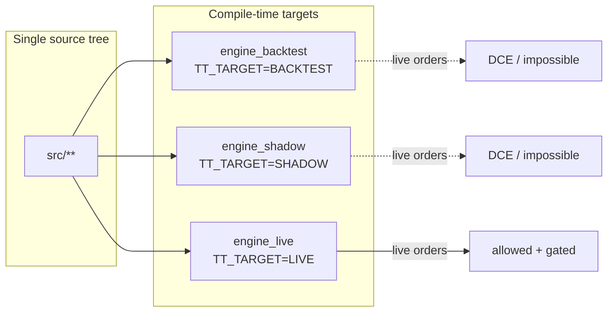

| Binary | `TT_TARGET` | Live orders | Primary use |
|--------|-------------|-------------|-------------|
| `engine_backtest` | `BACKTEST` | Impossible (DCE) | Historical replay, Monte Carlo |
| `engine_shadow` | `SHADOW` | Impossible | Real-time paper vs exchange tape |
| `engine_live` | `LIVE` | Allowed (gated) | Real money — experimental, attended |

Gate: `src/core/tt_target.h` → `constexpr target_allows_live_orders()`.

---

## 2. Layer graph (enforced)

Dependency direction is enforced by `scripts/check-layer-deps.sh`. Edges may only point to allowed lower/peer modules — never upward into composition roots from leaves.

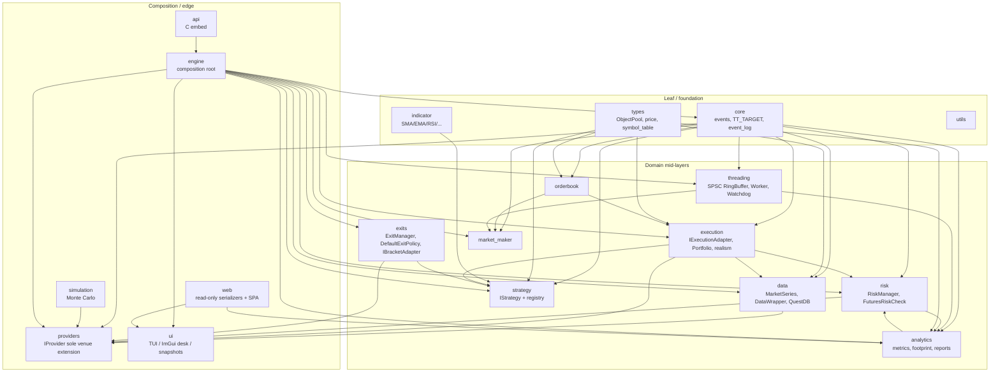

**Invariant**: Provider is the **sole venue extension point**. No `HAS_BINANCE` / venue leakage into `core`, `engine` generics, `threading`, or `risk` layers beyond the abstract `IRiskCheck` port.

---

## 3. Runtime system context

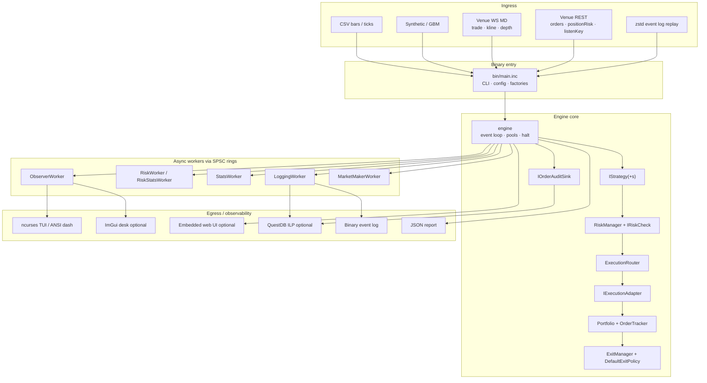

---

## 4. Hot-path data flow (event loop)

Zero-alloc discipline: acquire from pre-warmed `ObjectPool`s → strategy/risk/execution → `publish_event` fan-out to SPSC rings. No heap grow, no JSON, no multi-producer rings.

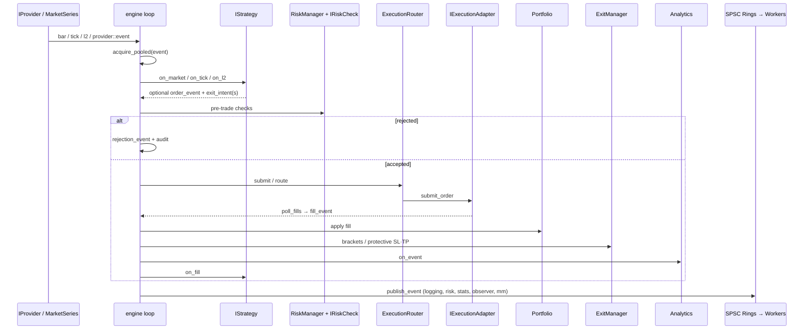

### Event types (`src/core/event.h`)

| Type | Role |
|------|------|
| `market` | OHLCV bar |
| `tick` | Trade / tick print |
| `l2_snapshot` / `l2_update` | Depth book |
| `order` | Strategy/platform intent |
| `fill` | Simulated or venue fill |
| `cancel` / `amend` / `rejection` | Order lifecycle |
| `funding` | Futures funding cash delta |
| `signal` | Reserved / legacy |

---

## 5. Mode × adapter matrix

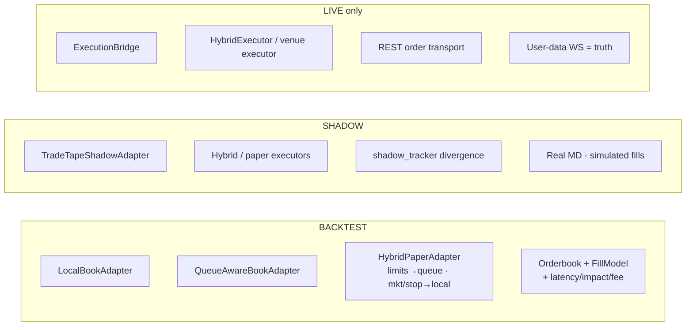

| Concern | Backtest | Shadow | Live |
|---------|----------|--------|------|
| Market data | CSV / synthetic / replay | Live venue WS | Live venue WS |
| Fills | Simulated (book + models) | Simulated vs real tape | Venue fills |
| Realism models | Active (if flagged) | Active (if flagged) | **Bypassed** |
| Live orders | Impossible | Impossible | Gated + safety stack |
| Protective exits | `ExitManager` engine-side | Engine-side | Engine-side + optional `IBracketAdapter` on venue |

Realism knobs (backtest/shadow only): latency, impact, walked-book, queue position, probabilistic fills, fees — see `docs/architecture/03-realism.md`.

---

## 6. Provider architecture (venue boundary)

`IProvider` is the **only** place venue knowledge may live. Engine consumes abstract ports.

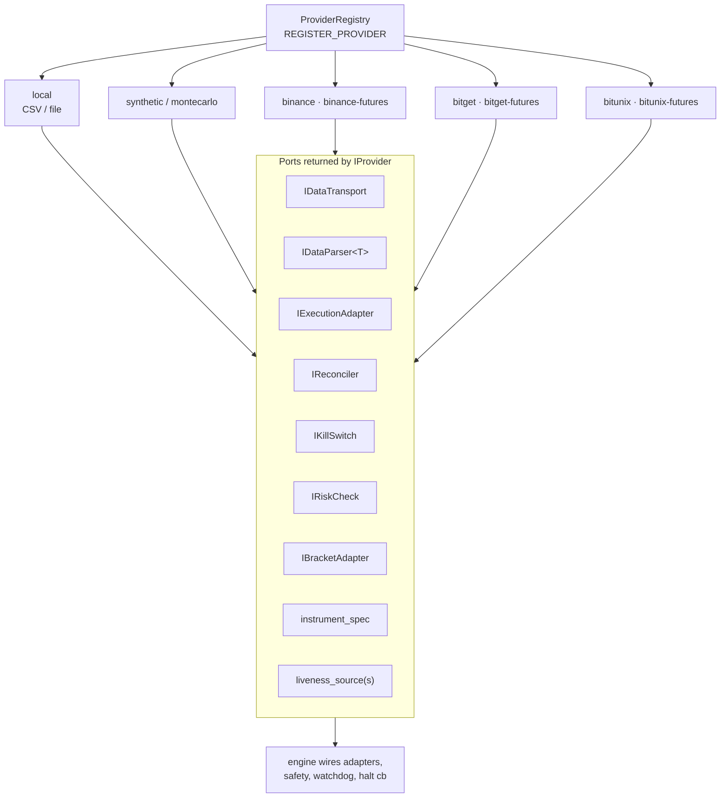

### Provider stack pattern

```
IProvider
  ├─ IDataTransport  (file / WS / combined / replay / synthetic)
  ├─ IDataParser<T>  (bar_record | tick_record | provider::event | venue payloads)
  ├─ DataBridge<T>   (batch load_into + run_streaming)
  └─ IExecutionAdapter (+ safety hooks)
```

### Futures safety stack (venue-owned, engine-wired)

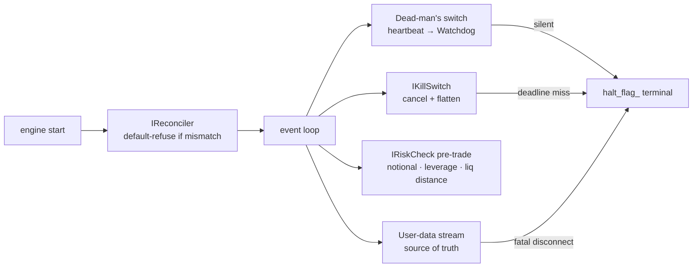

**Halt is write-once terminal** — process restart only; no auto-clear, no retry-with-backoff on safety paths.

---

## 7. Engine internals (composition root)

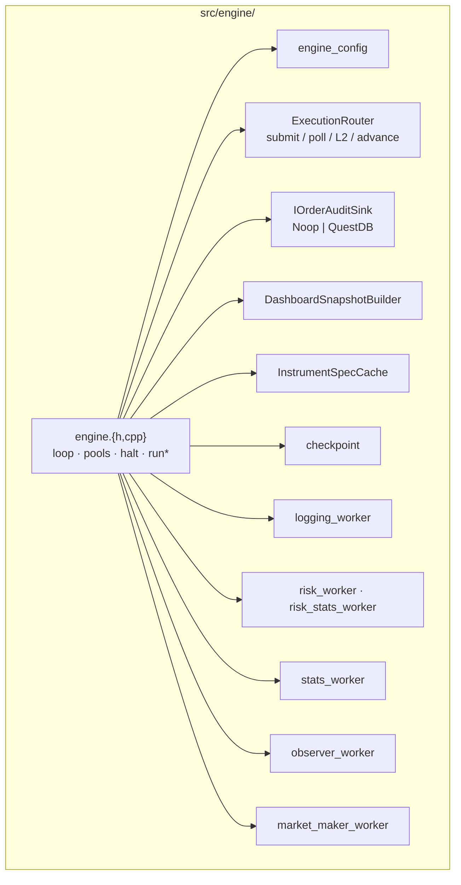

### Run paths

| Method | When |
|--------|------|
| `run()` | Batch bars from `MarketSeries` |
| `run_tick_data()` | Batch ticks |
| `run_streaming(DataBridge<…>)` | Live/shadow stream (bar, tick, or unified `provider::event`) |
| `run_replay(path)` | Deterministic zstd event-log replay |

### Decomposition seams (in progress)

Cold collaborators already extracted: `ExecutionRouter`, `IOrderAuditSink`, `DashboardSnapshotBuilder`, `InstrumentSpecCache`, `OrderAuditSink`. Further waves: `docs/internal/engine-decomposition.md`.

---

## 8. Threading model

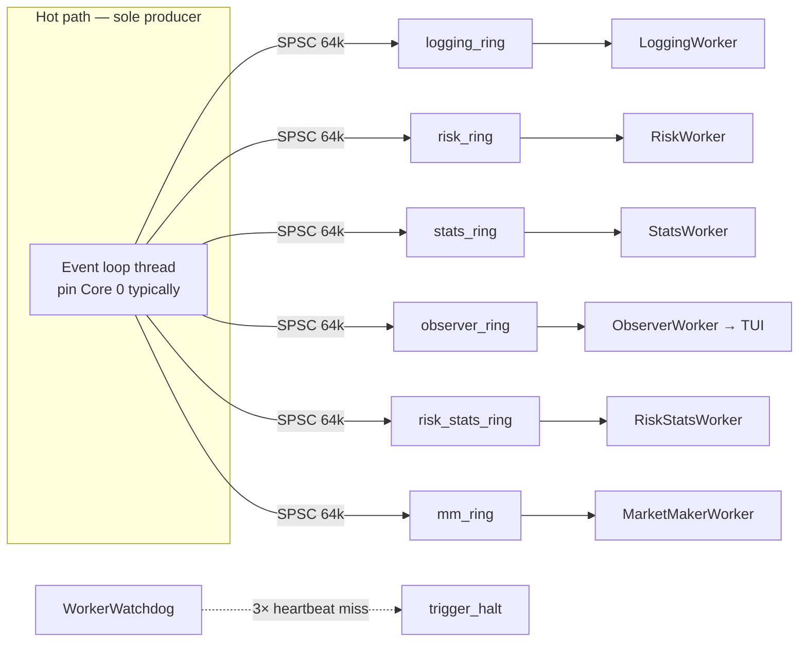

### Thread presets (`--thread-preset`)

| Preset | Typical cores | Workers |
|--------|---------------|---------|
| `inline` | 1–2 | None (everything on event loop) — required for `--mc-parallel` |
| `light` | 3 | Combined observer |
| `standard` | 4–5 | Logging + RiskStats |
| `full` | 6–7 | Logging + Risk + Stats |
| `extended` | 8+ | + MarketMakerWorker |

**Rules**: SPSC only; **exactly one producer** per ring; safety rings use `halt_on_drop` in shadow/live; spin policy `adaptive|spin|yield`.

### Memory discipline

```
prewarm ObjectPools + ControlBlockPool
  → forbid_runtime_grow = true
  → acquire_pooled on hot path
  → DeferredReturnQueue drain on engine thread
  → pool_exhausted → trigger_halt (fail closed)
```

---

## 9. Strategy & exits

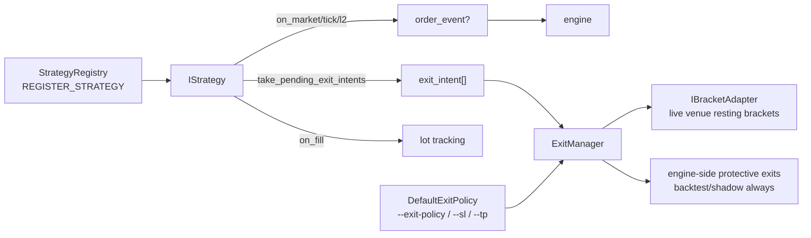

**Built-in strategies** (self-registering):  
`sma` · `ma-crossover` · `mean-reversion` · `breakout` · `coiled-spring` · `larry_connor` · `hedge-demo` · `adaptive-hybrid` · `structure-continuation`

**Indicators** (`src/indicator/`): SMA, EMA, RSI, Stochastic, Bollinger, ATR, swing detector, rolling extremes, EMA regime.

Platform protective SL/TP is **default** — strategies need not implement stops; `exit_intent`s refine.

---

## 10. Data pipeline

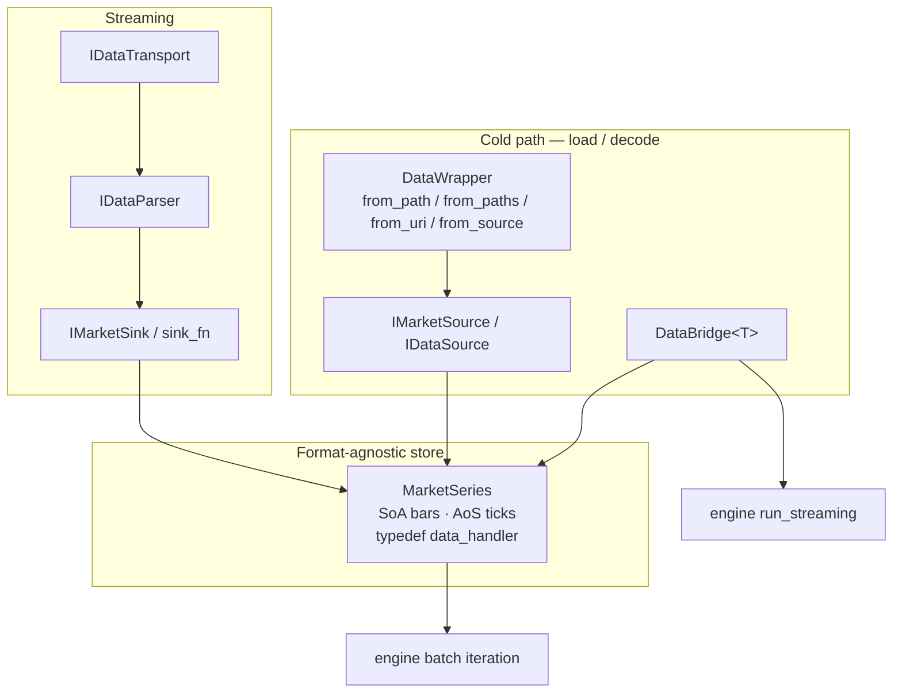

QuestDB (`src/data/questdb/`) is **audit egress** (ILP), not market-data ingress.

---

## 11. Monte Carlo research path

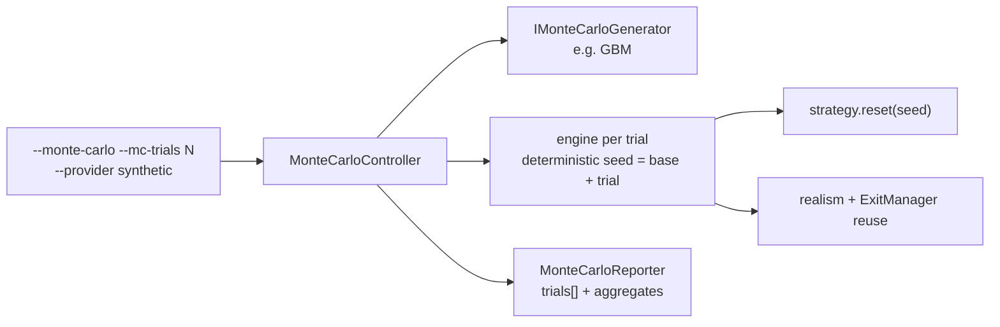

- Optional `--mc-reuse-objects` (reset instead of reconstruct).
- Experimental `--mc-parallel` only with `--thread-preset inline`.
- Stylized L2; research tool — does not relax live Phase 0/1 gates.

---

## 12. Observability surfaces

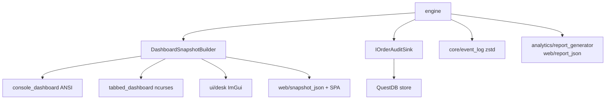

| Surface | Build flag / mode | Role |
|---------|-------------------|------|
| ANSI dashboard | always (backtest default) | Lightweight status |
| Rich ncurses TUI | shadow/live (`target_uses_rich_tui`) | Positions, orders, L2, risk, brackets, … |
| ImGui desk | `HAS_IMGUI_DESK` | Research / footprint panels |
| Web UI | `ENABLE_WEB` | Read-only snapshot + report SPA |
| QuestDB | `ENABLE_QUESTDB` | Soft-fail ILP audit (`--persist`) |
| Event log | always | Durable zstd record/replay |

---

## 13. Module map (`src/`)

| Module | Path | Responsibility |
|--------|------|----------------|
| **core** | `src/core/` | Events, event log, `TT_TARGET` |
| **types** | `src/types/` | Object pools, price, symbol table, control blocks |
| **engine** | `src/engine/` | Composition root, loop, workers, router, audit, snapshots |
| **providers** | `src/providers/` | Venue MD+exec: local, synthetic, Binance, Bitget, Bitunix |
| **strategy** | `src/strategy/` | `IStrategy`, registry, built-ins |
| **execution** | `src/execution/` | Adapters, portfolio, realism models, live safety ports |
| **orderbook** | `src/orderbook/` | Price-time book + fill model |
| **risk** | `src/risk/` | RiskManager, FuturesRiskCheck, margin tables |
| **exits** | `src/exits/` | ExitManager, DefaultExitPolicy, bracket adapter port |
| **data** | `src/data/` | MarketSeries, DataWrapper, CSV sources, QuestDB |
| **analytics** | `src/analytics/` | Metrics, adverse selection, footprint, reports |
| **indicator** | `src/indicator/` | Pure indicators |
| **threading** | `src/threading/` | RingBuffer, Worker, presets, watchdog |
| **simulation** | `src/simulation/` | Monte Carlo controller / generators / reporter |
| **market_maker** | `src/market_maker/` | Synthetic liquidity / quote management |
| **ui** | `src/ui/` | Dashboards, panels, ImGui desk |
| **web** | `src/web/` | JSON emit, embedded server, frontend SPA |
| **api** | `src/api/` | C API embed (`libtruetest`) |
| **bin** | `src/bin/` | `engine_{backtest,shadow,live}` + shared `main.inc` |

---

## 14. Safety freeze surface (Phase 1)

Mechanical freeze — edits require `LIVE_SAFETY_CCB_APPROVED` + CCB + protocol (`scripts/check-live-safety-freeze.sh`):

```
src/core/tt_target.h
src/engine/engine.cpp
src/providers/binance/binance_futures_provider.h
src/providers/binance/binance_futures_dead_mans_switch.h
src/providers/binance/binance_futures_kill_switch.h
src/providers/binance/binance_futures_reconciler.h
src/risk/risk_manager.h
src/risk/futures_risk_check.h
src/execution/live_safety.h
src/threading/worker_watchdog.h
```

### Safety red lines (compressed)

1. Compile-time live gate absolute — no runtime bypass.  
2. Halt is terminal (write-once).  
3. Kill / DMS / reconciler / watchdog: loud, non-retrying, fail-closed.  
4. Reconciler default-refuse; user-data stream is truth.  
5. Pre-trade: venue `IRiskCheck` before generic `RiskManager` on futures.  
6. No venue `#ifdef` leakage into generic core layers.

---

## 15. Build & verification topology

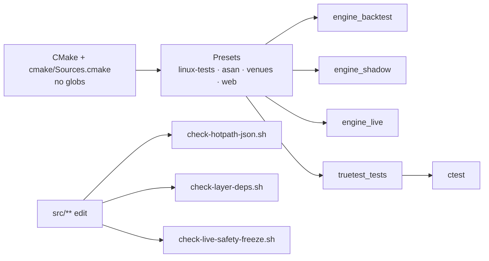

Optional features: `ENABLE_BINANCE`, `ENABLE_BITGET`, `ENABLE_BITUNIX`, `ENABLE_QUESTDB`, `ENABLE_WEB`, `ENABLE_BENCHMARKS`, `BUILD_SHARED_LIB`, sanitizers.

---

## 16. End-to-end mental model

```
                    ┌─────────────────────────────────────────┐
   CLI / API / MC   │              main.inc / API             │
                    └───────────────────┬─────────────────────┘
                                        │ wire config, provider, strategy
                                        ▼
   MarketSeries / IProvider ──► engine event loop (sole ring producer)
                                        │
                    ┌───────────────────┼───────────────────┐
                    ▼                   ▼                   ▼
               IStrategy(+)      RiskManager+IRiskCheck   Orderbook/MM
                    │                   │
                    └─────────┬─────────┘
                              ▼
                      ExecutionRouter → IExecutionAdapter
                              │
                    fills / rejects / cancels
                              ▼
                 Portfolio · ExitManager · Analytics · AuditSink
                              │
                              ▼ publish_event
                 SPSC rings → Logging / Risk / Stats / Observer / MM
                              │
                              ▼
                 TUI · Web · QuestDB · EventLog · Report JSON
```

**Same hot path** for backtest, shadow, and live.  
**Different edges**: data source, fill truth, whether live transport code exists after DCE.

---

## 17. Pointers

| Topic | Location |
|-------|----------|
| Agent rules / red lines | `AGENTS.md` |
| Operator architecture prose | `docs/reference/02-user-manual.md` |
| Target architecture extract | `docs/architecture/01-target-architecture.md` |
| Realism models | `docs/architecture/03-realism.md` |
| Performance capacities | `docs/architecture/04-performance.md` |
| Engine decomposition plan | `docs/internal/engine-decomposition.md` |
| Data pipeline plan | `docs/internal/data-pipeline.md` |
| CLI / MC / providers | `docs/reference/01-instructions.md` |
| Layer enforcement | `scripts/check-layer-deps.sh` |
| Live-safety freeze | `scripts/check-live-safety-freeze.sh` |
| Production phases | `docs/governance/01-prod.md` |

---

*Generated from a full read-only pass of the `core/` tree. No source code was modified for this document beyond creating `image.md`.*
